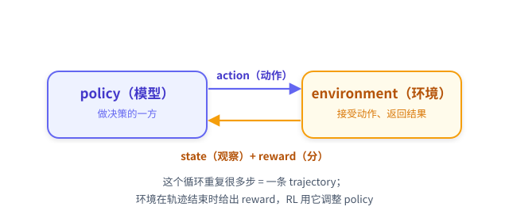

# 第 0 章：什么是强化学习？你的任务适合吗？

> 在装任何依赖之前，先用 10 分钟读完这一章。这一章不跑代码，只回答两件事：**强化学习到底在做什么**、**你的问题适不适合用它**。同时把后面 6 章会反复用到的几个词（state / action / reward / policy / trajectory）先认全。

---

## 0.1 一句话讲清强化学习

> **强化学习（Reinforcement Learning, RL）= 让一个「会做决策的模型」在「环境」里反复试错，用「环境给的分」来调整自己，最终学会拿高分。**

和你更熟悉的监督学习（SFT）对比一下，差异就清楚了：

| | 监督学习 SFT | 强化学习 RL |
|---|---|---|
| 学什么 | 模仿「标准答案」 | 摸索「怎么拿高分」 |
| 监督信号 | 每条数据给正确输出 | 每条**完整尝试**给一个分数（reward） |
| 数据从哪来 | 人提前准备好 | 模型自己**与环境交互**产生 |
| 适合 | 有标准答案的任务 | 答案不唯一、但**能自动判分**的任务 |

关键区别在第三行：RL 的数据不是人给的，是模型**自己玩出来的**。模型玩一局 → 环境打分 → 用分数调整模型 → 再玩一局……循环往复，分数越来越高。这就是「训练」。

---

## 0.2 RL 的核心词汇（先认全，后面每章都会用）

> 🕯️ **贯穿全教程的例子**：任务 = `put a candle in countertop.`（把一支蜡烛放到台面上）。后面每介绍一个概念，我们都会回到这个例子，告诉你「它在这个例子里具体是什么」——概念不悬空。

先看小机器人所在的房间：它知道周围有哪些家具，但需要走近观察，才能发现蜡烛。动画中的机器人代表做决策的模型，模型实际收到的仍是文字观察。

  
<a href="./alfworld_robot.html">打开二维小机器人动画：认识环境、逐步播放成功与失败轨迹</a>

查看原文

一次 RL 训练里只有 6 个角色。用上面的 candle 例子逐一对应：

| 词 | 含义 | 在 candle 例子里是什么 |
|---|---|---|
| **agent / policy（策略）** | 做决策的模型 | Qwen3-1.7B，它决定「为了把 candle 放到 countertop，下一步干什么」|
| **environment（环境）** | 接受动作、返回结果的世界 | ALFWorld 文字房间（有 countertop、toilet、cabinet…）|
| **state / observation（状态/观察）** | agent 当前看到的信息 | 一段文字：「你在房间里，看到 countertop 1、toilet 1…」|
| **action（动作）** | agent 这一步的选择 | 一条命令，如 `take candle 2 from toilet 1`、`move candle 2 to countertop 1` |
| **reward（奖励）** | 环境对**结果**的打分 | candle 放到 countertop → `1.0`；30 步没放上去 → `-0.1` |
| **trajectory / episode（轨迹）** | 从开始到结束的一整串 (state, action) | 这一局：look → 搜索 → take candle → move 到 countertop，共 9 步 |

把它们串起来就是 RL 的**交互循环**（第 2 章会逐行拆开）：

> 记住这张图和 candle 例子。后面所有章节都在这张图的某个箭头上做文章，并反复回到 candle 例子：第 2 章讲「循环怎么跑」，第 3 章讲「reward 怎么给」，第 4 章讲「reward 怎么变成可学习的信号」，第 5 章讲「信号怎么改 policy」。

---

## 0.3 你的任务适合 RL 吗

RL 不是万金油。三个条件**同时满足**才值得用：

1. **可验证的 reward**：能写一段代码给任意一次完整尝试打分，且**确定性**（同一次尝试跑两次得分一样）。
2. **非平凡的初始成功率**：模型一开始**偶尔能做对**（>0%，有正样本可学），但**远没全做对**（<100%，有改进空间）。
3. **需要多步决策**：任务不是一步问答，而是要连续做多个互相依赖的决定（否则退化成单步问题，RL 的优势体现不出来）。

**自检表**：

| 你的情况 | 该用什么 | 为什么 |
|---|---|---|
| 有清晰标准答案 + 一批高质量答案 | SFT | RL 没有信息增量，反而引入噪声 |
| 改改 prompt 就能从 30% 到 80% | Prompt 工程 | 一晚上 RL 不如你改一小时 prompt |
| 输出主观（文风/对话好坏），无法自动判分 | 人类偏好方法（如 DPO/RLHF）| 没有可计算的 reward |
| **能被程序自动判分 + 模型偶尔做对偶尔做错 + 需多步决策** | ✅ **RL** | 这正是 RL 的甜区 |

本教程的实验三条全中：ALFWorld 环境自带确定性判分；配套任务族样本中，base 模型的每局成功率约 10%（偶尔做对、大多做错）；每个任务要 5–30 步多子目标决策。

---

## 0.4 为什么用 ALFWorld 当实验环境

[ALFWorld](https://github.com/alfworld/alfworld) 把具身家务任务抽象成**文字冒险游戏**：agent 在纯文本房间里用命令与物体交互。选它当本教程的实验台，是因为它把 RL 的要素暴露得特别干净：

- **reward 由环境内置、确定**：任务完成 =1.0，否则 =-0.1，不需要你写判分器（第 3 章）。
- **天然多步 + 状态变化**：找物体 →（加热/冷却/清洗）→ 放目标，每步依赖前面累积的状态（第 2 章）。
- **难度有梯度**：6 个任务族从「单目标放置」到「多子目标转化」，能清楚看到 RL 先学会什么、还学不会什么（第 6 章）。

**6 个任务族**（本实验训练集 3553 个任务的真实分布 + 配套样本中的每局成功率）：

| 任务族 | 数量 | 要做什么 | base 成功率 |
|---|---:|---|---:|
| `pick_and_place` | 790 | 找物体放到目标 | 27.8% |
| `pick_two_obj` | 813 | 找**两个**同类物体放目标 | 5.8% |
| `pick_clean_then_place` | 650 | 找物体→水槽清洗→放 | 3.6% |
| `pick_cool_then_place` | 533 | 找物体→冰箱冷却→放 | 1.5% |
| `pick_heat_then_place` | 459 | 找物体→微波加热→放 | 4.7% |
| `look_at_obj_in_light` | 308 | 找物体→拿到灯下看 | 2.6% |

一眼可见：base 模型对最简单的族也才 27.8%，对多子目标族几乎不会（1.5%~5.8%）——**巨大的改进空间**，正是 RL 要填的。

---

## 0.5 本教程用的实验栈（知道即可，细节后面按需展开）

| 维度 | 选择 | 一句话说明 |
|---|---|---|
| 教程仓库 / 网页 | [Trinity-RFT 的 `tutorial` 分支](https://github.com/agentscope-ai/Trinity-RFT/tree/tutorial)（[网页版](https://agentscope-ai.github.io/agentic-rl)）| 本教程文档与可运行代码所在；框架以依赖引入 |
| 框架 | [Trinity-RFT](https://github.com/agentscope-ai/Trinity-RFT) | 底下真正干活的 RL 框架：把「rollout / reward / advantage / 更新」串成流水线 |
| 算法 | **GRPO**（multi-step 版）| 第 4、5 章的主角：用「组内相对比较」把 reward 变成更新模型的信号 |
| 模型 | Qwen3-1.7B | 小模型，8 卡跑得动、曲线看得清 |
| 硬件 | 8×A100（4 卡采样 + 4 卡训练）| 采样与训练并行，一步约 6 分钟 |
| 环境 | ALFWorld + TextWorld | 本地进程，reward 确定 |

> 你**不需要**先懂分布式训练、显存优化这些工程知识——本教程只讲 RL 的概念主线，工程细节一律从简（个别必要的做成悬停提示）。第 1 章你只需要会跑命令、会看曲线。

---

## 0.6 延伸：主流 RL 框架与训练后端对比（选工具时再看）

> 这一节**不影响你跑通本教程**（栈已经钉死），只是给你一张「以后自己选工具」的地图。第一次读可以跳过，等第 1 章跑通再回来看。

### 主流 RL 框架对比

| 框架 | 强项 | 短板 | 适合场景 |
|---|---|---|---|
| **Trinity-RFT**（本教程选用）| multi-step agentic 原生支持；**算法与训练后端解耦**；yaml 即配 | 文档 / 案例仍在补充 | 多步 agent RL（本教程这类）|
| verl | 性能强；FSDP / Megatron 调优深入 | 配置层级深、新手起步陡 | 大规模 RLHF、追求极致性能 |
| OpenRLHF | 起步简单、社区活跃 | 偏单步 RLHF，agentic 支持弱 | 经典 RLHF / 数学类任务 |
| TRL | HuggingFace 生态最熟、入门最浅 | 大规模训练性能不如 verl | 单卡 / 小规模实验 |

本教程选 Trinity-RFT 的核心理由是**算法与后端解耦**：同一份「算法 + 数据」配置可以换不同后端跑（见下表）。这对「先用最容易的方式跑通概念、再换后端/换规模」的学习路径很友好。

### 训练后端对比：Tinker / TuFT / 本地 GPU

「后端」= 真正做 forward / backward / 权重更新的地方。框架只负责把 rollout 和训练信号算好，把「更新模型」这件事委托给后端。三种常见选择：

| 后端 | 部署方式 | 你需要 | 适合 |
|---|---|---|---|
| **Tinker**（云服务）| 注册账号拿 API key | **0 张本地 GPU** | 零硬件入门首选 ⭐ |
| **TuFT**（自部署 server）| 在自己机器起训练 server | 有 GPU | 数据敏感 / 想改训练栈 |
| **本地 GPU（verl + vLLM）**（本教程）| 本机直接跑 trainer + rollout | 有 GPU（本教程 8×A100）| 环境是本地进程、想完全掌控、采样与训练并行提速 |

**为什么本教程用本地 GPU，而不是 Tinker / TuFT**：

- ALFWorld 环境是**本地 CPU 进程**（textworld），不是远程 sandbox；「env 在本机、模型在本机」用本地后端最自然。
- 我们要演示**采样与训练并行**（4 卡采样 + 4 卡训练，第 1 章 §1.1），本地多卡最容易排布。
- 全量微调 + 大 batch，本地资源完全可控。

> 三者**不是优劣之分，而是「资源 vs 掌控力」的取舍**：没 GPU 就用 Tinker 先跑通概念；有 GPU 且环境在本地（如本教程）就用本地后端；介于两者用 TuFT。关键在于：**第 2–5 章讲的 RL 概念（rollout / reward / advantage / loss）在三种后端下完全相同**——换后端只换「在哪算模型更新」，不换「RL 在学什么」。这正是算法与后端解耦的价值。

---

## 0.7 这一章你应该带走的

- ✅ **RL = 模型在环境里试错，用环境给的分调整自己**；与 SFT 的根本差异是「数据自己玩出来 + 信号是分数而非标准答案」。
- ✅ **6 个核心词**：policy / environment / state / action / reward / trajectory——后面每章都在这张交互循环图上做文章。
- ✅ **适合 RL 的三条件**：可验证 reward + 非平凡初始成功率 + 多步决策。
- ✅ **ALFWorld 是干净的实验台**：reward 内置确定、天然多步、难度有梯度；base 成功率 1.5%~27.8%，改进空间巨大。
- ✅ **工具地图（§0.6）**：框架看 Trinity-RFT / verl / OpenRLHF / TRL 的取舍；后端看 Tinker（零 GPU）/ TuFT / 本地 GPU 的取舍——**RL 概念在三者下完全相同**。

❌ **这一章你不需要懂**：reward 具体怎么广播、advantage 怎么算、loss 长什么样、权重怎么更新——分别是第 3/4/5 章的事。

💡 **留给自己的问题**：配套样本中 base 模型约有 10% 的任务局成功，意味着它「大部分时候是错的」。RL 凭什么能从这些少量成功经验里学到东西，让训练 reward 从负值一路升高？第 1 章先让你亲眼看到这条曲线，第 4 章再解释它为什么能涨。

---

**返回**：[教程总览](./README.md) ｜ **下一章**：[第 1 章：跑通 — 先看 RL 真的有用](./ch1_跑通.md)
