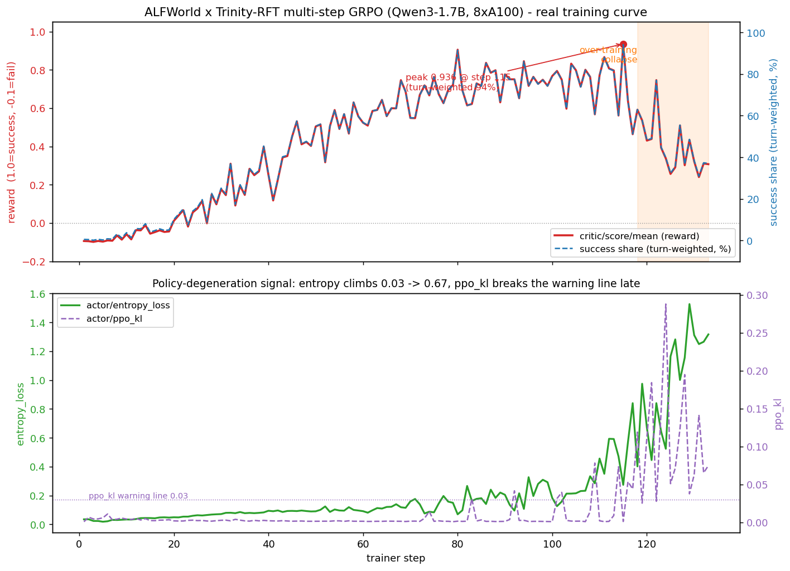

# 第 1 章：跑通 — 先看 RL 真的有用

> **本章模式：黑盒 / 操作**。我们不解释任何原理，只让你把训练跑起来、亲眼看到曲线。所有「为什么」都留到第 2–5 章。**本章只有 3 步**，绝大部分细节都被 `run.sh` 包掉了，你不用逐条敲命令。

---

## 1.0 这一章只有 3 步

```
① clone 仓库 + 准备数据/模型 + 填 .env      （~10 分钟， mostly 下载时间）
② bash run.sh                               （一条命令：装环境→生成数据→启动训练）
③ 预留约 15 小时 → 看曲线                       （reward -0.09 → +0.94 → 崩回 +0.31）
```

跑完之后你会看到：

- `critic/score/mean`（= 平均 reward）从 **-0.094（step 1）** → **+0.936（step 115 峰值）** → **+0.31（step 133，过度训练崩溃）**
- 这里先读 reward 曲线；它按训练样本统计，**不等于每局任务的等权成功率**（第 3 章会解释换算口径）。
- 另看配套任务族样本的每局成功率：6 个任务族里，最简单的 `pick_and_place` 从 27.8% 冲到 97.2%，最难的 `look_at_obj_in_light` 从 2.6% 到 69.4%
- **最终应采用 step-100 checkpoint**（崩溃前最佳平台期），而不是跑满的 step 133

**重要约定**：本章你**只看曲线、只抄命令**就行，不需要看懂任何超参 / 指标公式。看不懂是正常的，第 2–5 章会一层一层拆开。

> **代码版本**：本章与第六章 LoRA 使用同一个 [Trinity 版本](https://github.com/agentscope-ai/Trinity-RFT/commit/65139711219da4338c954e546c4b8434e4f75ec2)，运行脚本会自动安装。本章参考曲线来自 [Trinity `9a7e26e`](https://github.com/agentscope-ai/Trinity-RFT/commit/9a7e26e7d71b843d19e70344a2fe3b47efe2f418)；新版本的采样种子不同，实际曲线会有差异。

---

## 1.1 步骤 1：clone 仓库 + 准备数据/模型

训练环境使用 **Linux x86_64、Python 3.12、uv、支持 CUDA 13 的 NVIDIA 驱动和 8 张空闲 GPU**（参考为 A100 80GB）。一键入口会安装 PyTorch 与 CUDA 运行库，以及配套的 FlashAttention2 预编译包，不需要手工编译或打补丁。

```bash
# 1) clone 本教程分支
git clone --branch tutorial --single-branch https://github.com/agentscope-ai/Trinity-RFT.git agentic-rl
cd agentic-rl

# 2) 准备 ALFWorld 数据（~1.5GB）和一个 base 模型（本教程用 Qwen3-1.7B）
export ALFWORLD_DATA="$PWD/alfworld_data"
pip install alfworld==0.4.2 && alfworld-download  # 数据落到 $ALFWORLD_DATA
#    模型：从 HuggingFace 下载 Qwen/Qwen3-1.7B 到本地目录

# 3) 把两个路径填进 .env
cp .env.example .env
#    编辑 .env：ALFWORLD_DATA=<数据根目录>、TRINITY_MODEL_PATH=<模型目录>
#    数据根目录包含 json_2.1.1/ 和 logic/，不要填 json_2.1.1 本身。
```

> 如果你是在**网页上**读本教程（[agentscope-ai.github.io/agentic-rl](https://agentscope-ai.github.io/agentic-rl)）、还没 clone：上面的 clone 命令就是入口（配套代码位于 Trinity-RFT 的 `tutorial` 分支）。clone 下来后，文档在 `docs/RL_tutorial/`、可运行代码在仓库根目录。
>
> 数据和模型是**唯一需要你自己准备的两样东西**（都很大，主要是下载时间）。其余——装依赖、生成训练数据、启动训练——全部由下一步的 `run.sh` 自动完成。

---

## 1.2 步骤 2：`bash run.sh`（一条命令）

```bash
bash run.sh
```

就这一条。<span title="run.sh 内部依次：uv sync 装依赖（含 pin 的 trinity-rft）→ 从 $ALFWORLD_DATA 生成 taskset → ray start → trinity run 启动训练">**`run.sh` 已经把「装环境 + 生成数据 + 启动训练」三件事全包了**</span>，你不需要分开跑。想确认它到底做了什么，点开下面：

<details>
<summary>run.sh 内部做了什么（可选阅读）</summary>

1. `uv sync --locked --python 3.12`：建独立 `.venv`，按 `pyproject.toml` + `uv.lock` 精确安装依赖（trinity-rft 固定到与 LoRA 案例相同的读者版本、verl 0.9.0、vllm 0.23.0、torch 2.11、alfworld 0.4.2，以及 FlashAttention2 2.8.3）。FlashAttention 使用与 TuFT 配套、锁定 SHA-256 的社区 wheel，支持 Python 3.12 / Linux x86_64 / CUDA 13。
2. 生成 taskset：从 `$ALFWORLD_DATA` 的原始 game 文件生成 `examples/grpo_alfworld/alfworld_data/{train,test}.jsonl`（train 3553 / test 140 个任务）。taskset 里**没有标准答案**，reward 完全由环境判定（第 3 章）。
3. 用 `.venv/bin/ray` 启动本机 Ray，再直接调用 `.venv/bin/trinity run --config examples/grpo_alfworld_general_multi_step/alfworld.yaml`。启动与训练使用同一套依赖，不经过 `uv run`，并关闭 Ray 的 uv 环境复制 hook。

默认 Ray 的固定服务端口为 **16376–16379**（worker 另用动态端口），不占 Redis 常用的 6379。端口冲突会直接报错，不会替你停止其他实验；可在 `.env` 里设置另一段空闲端口的末端 `TRINITY_RAY_PORT`（使用该端口及前 3 个端口）。若要复用已有的同版本 Ray，显式设置 `RAY_ADDRESS=127.0.0.1:16379` 后再运行；脚本只检查并连接这个地址，不查找其他“最新”集群。训练结束后 Ray 保留，便于再次使用。

默认配置关闭 Qwen3 的 thinking 模式，直接生成任务动作；动态 batch 的 token 预算覆盖完整 prompt + response，避免长样本超出预算。日志默认使用 **TensorBoard**，无需 W&B 账号或密钥。

这个入口使用公开 PyPI 锁文件，显式选择公开索引；即使终端设置了临时 `UV_DEFAULT_INDEX` 镜像，也不会改写或重解析锁文件，既有包仍从锁定的公开地址下载。

> 想先确认流程能跑通，再做完整训练：在 YAML 中设置较小的 `trainer.total_steps`（如 5），观察采样、更新和保存是否正常，再开始新的完整实验。

</details>

<details>
<summary>硬件与 GPU 分工（可选阅读）</summary>

本实验用 **8×A100-80GB 单机**，8 张卡自动切成两半：

```
GPU 0 1 2 3   →  trainer：训练（全量微调 Qwen3-1.7B）
GPU 4 5 6 7   →  explorer：2 个推理引擎各占 2 卡，跑 rollout（采样）
```

- **为什么这么分**：采样和训练可以**重叠**——一半卡持续采样塞进 buffer，另一半卡从 buffer 取数据更新。本实验采样（~120s/step）远快于训练（~330s/step），所以瓶颈在训练。
- 你**不需要**手动分卡，框架会排；只要保证 8 张卡空闲。显存吃紧时框架有 <span title="把暂时不用的参数/优化器状态挪到 CPU 内存、需要时搬回 GPU，用一点速度换显存">offload</span> 等手段，知道有这回事即可。

</details>

---

## 1.3 步骤 3：预留约 15 小时，然后看曲线

启动后会刷日志。看到类似下面这种输出就说明正常（真实节选）：

```text
INFO ... [explorer.py] Explore step 1 started.        # ← 开始在 ALFWorld 里采样
INFO ... [monitor.py] Step 1: {'time/train_step': 464.36,
    'critic/score/mean': -0.094, 'actor/ppo_kl': 0.001, ...}   # ← 你要盯的就是 critic/score/mean
```

- **`critic/score/mean` 是本章的主要观察项**：这一步训练 batch 中各条 experience 的平均 reward。
- 这次历史日志从 step 0 到 133 约 **15.2 小时**。可以按约 15 小时安排时间，但这不是耗时保证；不同硬件、采样长度和运行状态都会影响墙钟时间。终端会打印 `Step N`，便于跟踪进度。
- 第一次跑就当背景跑，遇到报错截图存起来即可。

> ⚠️ **本实验的真实教训**：跑到 step 115 达峰后，**step ~118 开始崩**（过度训练），13 步不恢复，最终在 step 133 手动停止。**最终采用 step-100 checkpoint**。第 6 章「实验 A：早停」会复盘——**RL 不是跑得越久越好**。

起床后看曲线（二选一）：

```bash
# 方式 1：TensorBoard（默认记录，不需要 W&B 账号）
.venv/bin/tensorboard --logdir checkpoints/ALFWORLD/Step_Wise_Alfworld/monitor/tensorboard --port 6006

# 方式 2：用配套脚本从 trainer.log 重画本教程的图
python scripts/rl_tutorial/plot_reward_curve.py \
  --log checkpoints/ALFWORLD/Step_Wise_Alfworld/log/trainer.log --out /tmp/curve.png
```



**这张图一眼可见 4 件事**（后面章节逐一解释）：

1. **红线（reward）从 -0.094 抬到 +0.936（step 115 峰值）**——说明训练样本中的任务表现明显改善。
2. **蓝虚线是同一 reward 换算出的成功占比，按 turn/experience 加权**；它不是独立评测，也不是每局等权成功率（第 3 章）。
3. **step 20 附近穿过 0**：相比全失败时的 −0.1 已有改善，但分数转正不等于成功过半（换算公式见第 3 章）。
4. **橙色区（step ~118-133）崩溃**：reward 跌到 0.24-0.44 且不恢复，同时 entropy / ppo_kl 飙升——「训练过头、策略退化」的典型信号（第 5 章 §5.5）。

**这条「涨上去又掉下来」的完整曲线，比单调上升的曲线更有教学价值**：它既证明 RL 有用，也告诉你 RL 有最佳停止点。

---

## 1.4 这一章你应该带走的

- ✅ **跑通只有 3 步**：clone + 填 .env → `bash run.sh` → 等 + 看曲线；装环境/生成数据/启动都被 run.sh 包办。
- ✅ **RL 真的有用**：训练 reward -0.094 → +0.936（step 115），展示这次训练中任务表现的改善。
- ✅ **但 RL 也会崩**：step ~118 起过度训练崩回 +0.31；**最终模型取 step-100 checkpoint**。第 5 章解释为什么。
- ✅ **看曲线的锚点**：`critic/score/mean`（训练 batch 平均 reward）+ step 数；本次全程约 15 小时，仅作历史参考。

❌ **你还不需要懂**：

- 一条 trajectory 内部 obs→action 怎么循环（→ 第 2 章）
- reward 为什么是 -0.1 / 1.0、换算成功占比时按什么单位统计（→ 第 3 章）
- 为什么后期会崩溃、entropy / ppo_kl 是什么（→ 第 5 章）

💡 **留给自己的问题**：你看到 reward 从 -0.094 起步。为什么「全失败」不是 0 而是 **-0.1**？这个负号在 RL 训练里起了什么关键作用？第 3 章揭晓。

---

**返回**：[教程总览](./README.md) ｜ **下一章**：[第 2 章：rollout — state / action / reward 与 experience](./ch2_rollout与experience.md)
