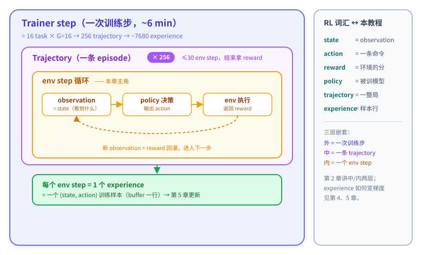

# 第 2 章：rollout — state / action / reward 与 experience

> **本章模式：拆解**。第 1 章你看到 reward 从 -0.09 涨到 +0.94，但还没看清「模型到底在环境里做了什么」。这一章打开黑盒第一层：**一次 rollout（交互循环）内部**，并把第 0 章的词汇（state / action / reward / trajectory）逐个落到真实数据上，最后引出 RL 的训练样本单位——**experience**。

---

## 2.0 概念地图：三层结构 + 对应到 RL 词汇

先记住一个三层结构（后面几章都会反复回到它）：



把这三层对应到第 0 章 §0.2 的 RL 词汇——**右栏用贯穿全教程的 candle 例子**（`put a candle in countertop.`）回顾，这样每个词你都能立刻对上号：

| RL 词汇 | 含义 | 在 candle 例子里是什么 |
|---|---|---|
| **state** | agent 当前看到的信息 | 「你在房间里，看到 countertop 1、toilet 1…」这段文字 |
| **action** | agent 这一步的选择 | `take candle 2 from toilet 1`、`move candle 2 to countertop 1` |
| **reward** | 环境对结果的打分 | candle 放上台面 → `1.0`；30 步没放上去 → `-0.1` |
| **trajectory** | 一整局（obs→act→obs→…）| §2.3 那条 9 步的 candle 轨迹 |
| **experience** | 一个 (state, action) 训练样本 | candle 轨迹里的每一步（共 9 个）|
| **policy** | 做决策的模型 | Qwen3-1.7B |

> 这些词在数据里怎么存（buffer 的字段），等用到时再讲（§2.5 / §2.6）——现在你只需要认准 candle 例子里的它们。

**这一章只看最里面两层**：单条 trajectory 内部，模型怎么一步步和 env 交互；以及一条 trajectory 怎么切成多个 experience 供训练用。

---

## 2.1 rollout 的一步：state → action → reward 怎么走

先在动画里看一次具体交互。动画从“已经发现蜡烛”的时刻开始自动循环，也可暂停后点击**下一步**观看拿起动作：执行前的观察、动作指令和执行后的反馈会同时展示。

<div class="alf-player" data-mode="step">
  <p><a href="./alfworld_robot.html">打开二维小机器人动画</a>，在成功轨迹中查看拿起蜡烛的一步。</p>
</div>

<details markdown="1" class="tutorial-original" id="original-step">
<summary aria-label="查看原文：一步交互的伪代码与完整讲解">查看原文</summary>

回忆 §0.2 的交互循环。把它落到「一步」上，就是这样一个循环（**伪代码**，帮你建立概念，不是真实源码）：

```text
state = env.reset()
    # candle 例子：初始观察 =「你在房间中间，看到 countertop 1、toilet 1、cabinet 1…」

for step in 1 .. 30:                          # 一条轨迹最多 30 步
    action = policy(state)
    # candle 例子：模型看当前观察，输出一条命令——如 step 6 输出 take candle 2 from toilet 1

    state, reward, done = env.step(action)
    # candle 例子：执行 take candle 2 后，返回新观察「You pick up the candle 2 from the toilet 1」

    把 (state, action) 记成一个 experience
    # candle 例子：「看到 candle 的这个 state + take candle 2 这个 action」= 一个训练样本

    if done: break
    # candle 例子：step 8 move candle 2 to countertop 1 后，candle 放上台面 → done=True，提前结束

# 轨迹结束：环境给出最终 reward
    # candle 例子：candle 放上台面 → reward = 1.0（§2.2 那条失败：30 步没放上去 → -0.1）
```

三个**概念点**（不需要看源码就能懂）：

- **state 是「累积的上下文」**：用 candle 例子，模型第 6 步看到的 state 不只是「toilet 1 上有 candle 2」这一句，而是**从第 0 步到现在的全部历史**（look → go to countertop 1 → … → go to toilet 1 → 看到 candle 2）。所以每步决策都建立在前面所有步之上——这就是「多步状态变化」。
- **episode 有长度上限**：最多 30 步。30 步内任务完成（`done`）→ 成功 reward `1.0`；30 步还没完成 → 失败 reward `-0.1`。（candle 例子：§2.3 那条 9 步就放上台面成功；§2.2 那条 30 步耗尽失败。）
- **每步产出一个 experience**：用 candle 例子，第 6 步的 experience = 「在 toilet 1 看到 candle 2 的 state」+「`take candle 2 from toilet 1` 这个 action」。9 步的 candle 轨迹就产出 9 个这样的 experience，正是第 4、5 章用来算 advantage、更新权重的训练样本。

> 模型每步被要求输出这个<span title="注意：本实验 enable_thinking:false——chat 模板会在 prompt 末尾预置一对空 think 标签来抑制思考，所以模型实际输出几乎从不带 think 标签（40 万条里仅 2 条）。真实输出只有两种：① 裸的 pre-action 推理文本 + action 标签；② 只有 action 标签。">**格式**</span>（system prompt 规定）：`<think>为了完成任务，我需要先...</think><action>go to cabinet 1</action>`。关于 think 标签的真实细节见下方折叠。

<details>
<summary>实际实现：StepWiseAlfworldWorkflow 源码与 parse_action / memory 细节（可选阅读）</summary>

整条 trajectory 由 trinity-rft 包里的 [`trinity/common/workflows/envs/alfworld/alfworld_workflow.py`](https://github.com/agentscope-ai/Trinity-RFT/blob/65139711219da4338c954e546c4b8434e4f75ec2/trinity/common/workflows/envs/alfworld/alfworld_workflow.py) 的 `StepWiseAlfworldWorkflow` 驱动（框架作为依赖安装，源码不在本仓库）。核心是它的 `step()`——每个 env step 调用一次：

```python
def step(self, step_num: int) -> bool:
    if self.done:
        return False
    # 1) 把当前 observation 格式化（"Observation: ..."），并算一个状态哈希（第 4 章 GiGPO 用）
    format_obs = format_observation(self.observation)
    env_state_hash = hashlib.sha256(format_obs.encode()).hexdigest()
    self.memory.append({"role": "user", "content": format_obs})

    # 2) 把「从开头到现在的完整对话历史」喂给模型，拿一个 action
    responses = self.model.chat(self.memory)
    response_text = responses[0].response_text
    self.memory.append({"role": "assistant", "content": response_text})
    action = parse_action(response_text)          # 从 <action>...</action> 里抠出动作

    # 3) env 执行 action，返回新 observation + 即时 reward + 是否结束
    observation, reward, done, info = self.env.step(action)
    self._step_meta.append((env_state_hash, float(reward)))

    self.observation = observation
    self.done = done
    if self.done:
        self.final_reward = reward                # 任务完成 → reward=1.0
    return not self.done                          # done 了就停止这条 trajectory
```

实现级要点（只有读了上面源码才有意义）：

1. **`self.memory`** 是从头累积的完整对话历史 `[system, user(obs0), assistant(act0), ...]`——对应上面概念点里的「state = 累积上下文」。
2. **`parse_action`** 从模型输出里抠 `<action>...</action>` 之间的文本当命令；抠不到就返回空串（env 会回 "Nothing happens."）。
3. **`max_env_steps = 30`** 是循环上限——对应概念点里的「episode 长度上限」。

</details>

<details>
<summary>关于 think 标签与输出格式的细节（可选阅读）</summary>

- `enable_thinking: false` 的实现方式是：**chat 模板在 prompt 末尾预置一对空 think 标签**（`prompt_text` 结尾可见 `assistant\n<think>\n\n</think>`），让模型「接着空块往下写」从而抑制思考。
- 实测 40 万条 `response_text` 中，模型**自己写出非空 think 标签**的仅 **2 条（0.00%）**。真实输出只有两种形态：① **裸的 pre-action 推理文本** + `<action>`（早期 56%、后期 33%）；② **只有 `<action>`**（早期 36%、后期 61%）。
- 因此下面轨迹展示里，`reason:` 和 `action:` **都是模型这一步的输出**（同属 `response_text`）：`reason:` = `<action>` 标签**之前**那段裸的自由推理文本（**不是** prompt 里的固定输入，也**不是** think 标签内容）；`action:` = 标签内被 `parse_action` 抠出来送给 env 的命令。很多步连 reason 都没有、`response_text` 里只有 `<action>`。

</details>

</details>

---

## 2.2 一条真实失败轨迹（base policy，step 1 时代）

用同一套画法看失败过程：打开柜子后拿了纸卷，后面的放置指令无效，纸卷一直留在手里；反复执行无效指令，直到 30 步耗尽。可以拖动进度条或切换快速播放。

<div class="alf-player" data-mode="fail">
  <p><a href="./alfworld_robot.html">打开二维小机器人动画</a>，选择“失败轨迹”。</p>
</div>

<details markdown="1" class="tutorial-original" id="original-fail">
<summary aria-label="查看原文：失败轨迹与逐步分析（30 步）">查看原文</summary>

下面是本实验 buffer 里**真实的一条失败轨迹**（`batch=1, task=1, run=14`，训练最开始时的 base policy）。运行 `python scripts/rl_tutorial/ch2_inspect_trajectory.py --sample fail` 可复现：

**任务**：`put a candle in countertop.`（`pick_and_place` 族，最简单的族）

```
[step 0] Obs: -= Welcome to TextWorld, ALFRED! =-  You are in the middle of a room...
         reason: To solve the task, I need first to find a candle and then put it on the countertop...（裸文本，无 think 标签）
         action: look
[step 1] Obs: You are in the middle of a room. Looking quickly around you, you see nothing...
         reason: I need to search the room thoroughly to find a candle...
         action: go to cabinet 1
[step 2] Obs: You arrive at cabinet 1. The cabinet 1 is closed.
         action: open cabinet 1
[step 3] Obs: You open the cabinet 1. In it, you see a toiletpaper 1...   ← 里面是 toiletpaper，不是 candle！
         action: look in cabinet 1                                        ← ❌ 无效动作
[step 4] Obs: Nothing happens. Please check if the action you take is valid...
         action: take toiletpaper 1 from cabinet 1                        ← ❌ 拿错物体！任务要 candle
[step 5] Obs: You pick up the toiletpaper 1 from the cabinet 1.
         action: go to countertop 1
[step 6] Obs: You arrive at countertop 1. On the countertop 1, you see nothing.
         action: put toiletpaper 1 on countertop 1                        ← ❌ 放置指令无效，纸卷仍在手里
[step 7] Obs: Nothing happens. Please check if the action you take is valid...
         action: take toiletpaper 1 from countertop 1
[step 8] Obs: Nothing happens. ...
         action: look around
[step 9..29] action: look around  ×21                                     ← ❌ 卡死循环，重复 22 次
→ 30 步耗尽，任务未完成，reward = -0.1
```

**这条轨迹暴露了 base policy 的 3 个典型缺陷**：

| 缺陷 | 表现 | 为什么致命 |
|---|---|---|
| ① **拿错物体** | 任务要 candle，它拿了 toiletpaper | 没验证物体身份就行动，方向从一开始就错了 |
| ② **无效动作** | `look in cabinet 1` / `put toiletpaper 1 on countertop 1` → "Nothing happens." | 不熟动作语法，浪费步数 |
| ③ **卡死循环** | step 8-29 重复 `look around` 22 次 | **看到 "Nothing happens" 也不会换策略**，直到耗尽 30 步 |

> 注意 ③ 是最致命的：模型**收到了明确的失败信号**（"Nothing happens. Please check if the action you take is valid..."），却完全不会调整，只是无意义地重复。这正是 RL 要修复的核心行为——**学会从 observation 反馈里改策略**。
>
> 还有个细节：step 0-1 模型还会输出一段**裸的 pre-action 推理文本**（注意**没有** think 标签——`enable_thinking: false`，见 §2.1 的 0.00% 实测），从 step 2 起连这段裸文本也省了、只吐 `<action>`，response 长度从 39 token 掉到 9-18 token。base policy 连输出格式都不稳定。

[打开原始失败样本 JSON](../../scripts/rl_tutorial/sample_data/traj_fail_early.json)

</details>

---

## 2.3 同一个任务，训练后的成功轨迹

成功轨迹沿用相同的小机器人和交互方式。注意：两条记录的**任务指令相同，但房间陈设不同**；这里展示各自记录中的环境，不能把它们当作同一个房间初始状态下的严格前后对照。

<div class="alf-player" data-mode="success">
  <p><a href="./alfworld_robot.html">打开二维小机器人动画</a>，选择“成功轨迹”。</p>
</div>

<details markdown="1" class="tutorial-original" id="original-success">
<summary aria-label="查看原文：成功轨迹与逐步分析（9 步）">查看原文</summary>

§2.2 那条失败轨迹的任务是 `put a candle in countertop.`。下面是**同一个任务**在训练后的成功 rollout（`batch=166, task=5, run=9`，9 步完成）。运行 `python scripts/rl_tutorial/ch2_inspect_trajectory.py --sample success` 可复现：

**任务**：`put a candle in countertop.`（与 §2.2 完全相同）

```
[step 0] Obs: -= Welcome to TextWorld, ALFRED! =- You are in the middle of a room...
         action: look
[step 1] Obs: You are in the middle of a room. Looking quickly around you, you see...
         action: go to countertop 1
[step 2] Obs: You arrive at countertop 1. On the countertop 1, you see a soapbar 1...（没有 candle）
         action: look
[step 3] Obs: You are facing the countertop 1. Next to it, you see nothing.
         action: go to bathtubbasin 1
[step 4] Obs: You arrive at bathtubbasin 1...（没有 candle）
         action: look
[step 5] Obs: You are facing the bathtubbasin 1. Next to it, you see nothing.
         action: go to toilet 1
[step 6] Obs: You arrive at toilet 1. On the toilet 1, you see a candle 2...   ← 找到 candle！
         action: take candle 2 from toilet 1
[step 7] Obs: You pick up the candle 2 from the toilet 1.
         action: go to countertop 1
[step 8] Obs: You arrive at countertop 1...
         action: move candle 2 to countertop 1        ← candle 放到 countertop，任务完成
→ 9 步完成，reward = 1.0
```

**和 §2.2 的失败对照**：同一个任务，base policy 拿错物体（把 toiletpaper 当 candle）+ 卡在 `look around` 死循环、30 步耗尽；训练后**正确找到 candle、放到 countertop、9 步搞定**。RL 学到的就是：找对物体 + 系统搜索 + 不浪费步数。

[打开原始成功样本 JSON](../../scripts/rl_tutorial/sample_data/traj_success_late.json)

</details>

---

## 2.4 对照表：同一个任务，base policy vs 训练后

| 维度 | base policy（§2.2 失败）| 训练后（§2.3 成功）|
|---|---|---|
| 物体识别 | 拿错（toiletpaper 当 candle）| 拿对（candle 2）|
| 搜索策略 | 卡 `look around` 死循环 22 次 | 系统搜索：countertop → bathtubbasin → toilet |
| 失败恢复 | 收到 "Nothing happens" 也不换招 | 不需要恢复（动作都合法）|
| 步数 | 30（耗尽）| 9（高效）|
| reward | **-0.1** | **+1.0** |

→ **这 5 行就是 reward 从 -0.09 涨到 +0.94 的微观解释**。RL 没有让模型「变聪明」，而是在「该拿哪个物体、该去哪找、看到失败信号要不要换招」这些小决策点上变稳。

---

## 2.5 一条 trajectory 怎么变成「多个 experience」

回到 candle 例子。§2.3 那条成功轨迹（9 步）就是**一条 trajectory**：

```text
step 0: state=「你在房间里…」          action=look
step 1: state=「看到 countertop 1…」   action=go to countertop 1
   ...
step 8: state=「你到了 countertop 1…」 action=move candle 2 to countertop 1   ← candle 放上台面，任务完成
```

但 RL 训练不能把「一整局」当成一个样本——它要把每一步拆成单独的训练样本，每个样本叫一个 **experience**。于是这条 9 步的 trajectory 切成 **9 个 experience**：

```text
trajectory（candle，9 步）                  →  9 个 experience（训练样本）

experience 0:  state=「你在房间中间，看到 countertop 1、toilet 1…」  +  action=look
experience 1:  state=「你看到 countertop 1，上面没有 candle…」        +  action=go to countertop 1
   ...
experience 8:  state=「你到了 countertop 1…」                        +  action=move candle 2 to countertop 1

整局的 reward（candle 放上台面 → 1.0）
        └──────── 广播到上面 9 个 experience ────────┘
```

**一条 trajectory = N 个 experience**，每个 experience = 这一步的 (state, action)。这就是第 4、5 章用来算 advantage、更新权重的**训练样本单位**。

每个 experience 只携带三样东西（概念级）：

| 携带什么 | 在 candle 例子里 |
|---|---|
| **state** | 这一步看到的房间文字（如「你到了 toilet 1，看到 candle 2」）|
| **action** | 这一步的命令（如 `take candle 2 from toilet 1`）|
| **reward** | 整局最终分（candle 放上台面 = 1.0）——**9 个 experience 都相同** |

> **为什么 reward 要「广播」到每一步**：RL 是在**轨迹级别**判断这局好不好的（第 4 章），所以轨迹里的每个样本都要携带「这局最终成没成」。中间步骤本身没有单独的分（第 3 章讲的稀疏 reward）。

> **这些 experience 去哪了？——放进「buffer」**：rollout 产出的 experience 不会马上拿去训练，而是先收集到一个叫 **buffer**（经验池）的地方存起来；trainer 再从里面一批一批取出来算 advantage、更新权重（第 4、5 章）。所以 buffer 就是「experience 的存放处」。下面折叠里讲的，就是 buffer 里每个 experience 还带了哪些实现级字段。

<details>
<summary>buffer 字段细节：eid / env_state_hash / step_reward 与源码（可选阅读）</summary>

buffer 里每行除了上面三样概念字段，还有一些实现级字段（初学者可跳过）：

- **`eid`**：轨迹与步骤编号（`batch/task/run/step`），用来定位「哪条轨迹的第几步」。
- **`info.env_state_hash`**：这一步 state 的哈希，第 4 章 GiGPO（进阶）用它做「同状态分组」。
- **`info.step_reward`**：这一步的**即时** reward（中间步 = 0，成功那一步 = 1）。

**`reward` 和 `step_reward` 的区别**（容易混）：

| | `reward` | `info.step_reward` |
|---|---|---|
| 是什么 | 整局的**最终**得分 | 这一步的**即时**得分 |
| 取值 | 同轨迹每步都相同（1.0 或 -0.1）| 大多是 0，只有成功那一步是 1 |
| 谁用 | GRPO（第 4 章主线）| GiGPO（第 4 章进阶）|

> 📎 读 buffer 时你会看到 `prompt_text` 里夹着 `<|fim_prefix|>`/`<|fim_middle|>` 这类 chat-template 标记——那是「模型实际看到的 token 序列」的真实样子（Qwen 用 ChatML 模板），不是 bug，当成对话分隔符即可。

experience 切分的源码骨架：

```python
# RewardPropagationWorkflow.run() 的骨架
def run(self):
    experiences = []
    for step in range(self.max_step_num):          # 最多 30 步
        continue_run = self.step(step_num=step)     # 跑一个 env step（§2.1）
        exps = self.model.extract_experience_from_history()  # 把这一步的 (prompt, response) 抽成 experience
        for exp in exps:
            exp.eid.step = step                     # 标记这是轨迹内第几步
        experiences.extend(exps)
        if not continue_run:
            break
    reward = self.reward(experiences)               # 整条轨迹一个终止 reward（第 3 章）
    for exp in experiences:
        exp.reward = reward                         # ← 终止 reward 广播到每一步
        exp.metrics["actual_env_steps"] = step + 1
    return experiences
```

</details>

---

## 2.6 动手试试

> 以下脚本让你亲手查看 trajectory 内部。即使不跑训练，也能直接用预置的真实样本体验。

```bash
# 方式 1：看预置的失败轨迹（base policy，拿错物体 + 死循环）
python scripts/rl_tutorial/ch2_inspect_trajectory.py --sample fail

# 方式 2：看预置的成功轨迹（训练后，多子目标 10 步搞定）
python scripts/rl_tutorial/ch2_inspect_trajectory.py --sample success

# 方式 3：并排对比失败 vs 成功（推荐！）
python scripts/rl_tutorial/ch2_inspect_trajectory.py --sample compare

# 方式 4：用你自己跑出的 buffer（指向完整 buffer.jsonl，按 batch/task/run 定位一条轨迹）
python scripts/rl_tutorial/ch2_inspect_trajectory.py \
  --buffer checkpoints/ALFWORLD/Step_Wise_Alfworld/buffer/alfworld_buffer.jsonl \
  --batch 1 --task 1 --run 14
```

> 方式 1-3 用 `sample_data/` 里预置的真实样本，无需完整 buffer；方式 4 用你自己跑出的产物。
>
> ⚠️ 方式 4 的 `--buffer` 要的是**存轨迹的 experience buffer**（不是只存指标的 `trainer.log`）。跑过 `run.sh` 后它就在 `checkpoints/ALFWORLD/Step_Wise_Alfworld/buffer/alfworld_buffer.jsonl`。`--batch/--task/--run` 是轨迹 id（batch = 第几个 explore step、task/run ∈ 1..16），换轨迹改这三个数即可。

---

## 2.7 这一章你应该带走的

- ✅ **trajectory 的本质**：一段 `[system, obs0, act0, obs1, act1, ...]` 的历史，每步决策都看到前面所有上下文，最多 30 个 env step。
- ✅ **reward +1.0 的来源**：不是模型变聪明，而是在「拿哪个物体、先去哪个 receptacle、看到 Nothing happens 要不要换招」这些小决策点上变稳。
- ✅ **experience 是训练样本单位**：一条轨迹 = 多个 experience（每 env step 一个 = 一个 (state,action) 对），终止 reward 广播到每一步。
- ✅ **base policy 三重缺陷**：拿错物体、无效动作、卡死循环不会恢复。

❌ **你还不需要懂**：

- 那个广播到每一步的 reward 具体是 -0.1 还是 1.0、怎么换算成功率（→ 第 3 章）
- 同一个 task 的 16 条 trajectory 之间怎么比较出 advantage（→ 第 4 章）

💡 **留给自己的问题**：你现在知道一条轨迹末尾会拿 `1.0`（成功）或 `-0.1`（失败），而且这个值被**广播到轨迹的每一步**。为什么失败是 **-0.1** 而不是 **0**？这个负号在「组内相对比较」里起了什么关键作用？第 3 章揭晓。

---

**上一章**：[第 1 章：跑通](./ch1_跑通.md) ｜ **下一章**：[第 3 章：reward 怎么算](./ch3_reward怎么算.md)
