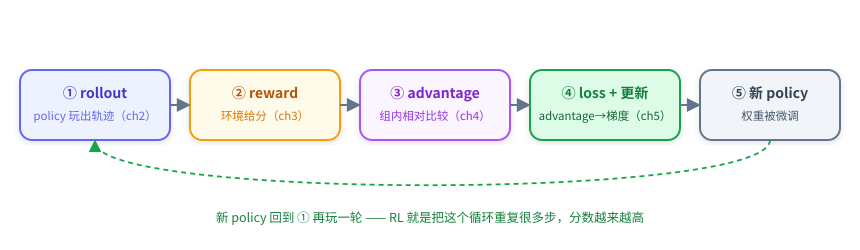
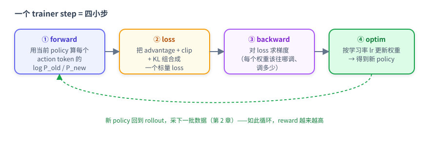
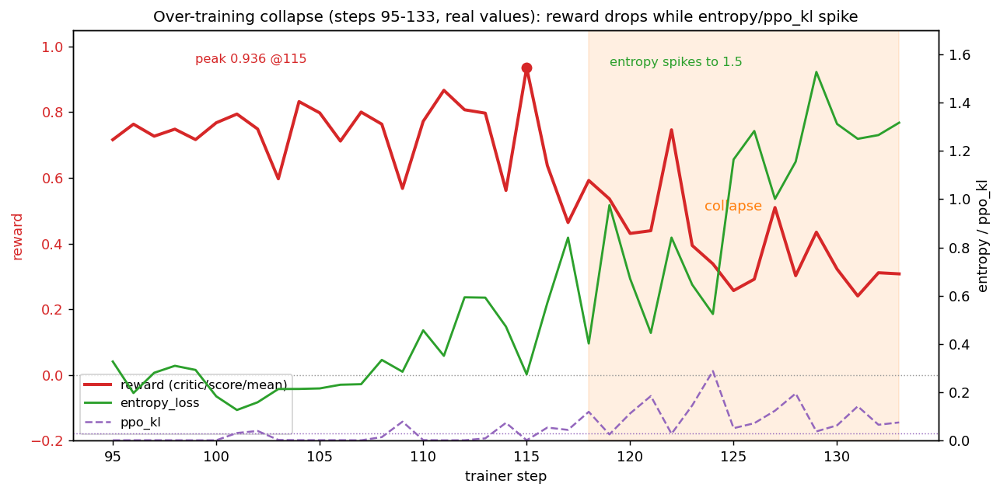

# 第 5 章：loss 与更新 — advantage 怎么变成梯度

> **本章模式：拆解**。第 4 章你算出了每条轨迹的 advantage（成功 +2.0、失败 -0.47）。这一章回答最后一个问题：**这个数怎么真正改变模型？** 即 advantage → loss → 梯度 → 新权重。讲完你就闭环了：第 0 章那张交互循环图里「用分数调整 policy」的箭头，本章把它拆开。

---

## 5.0 先回到大图：更新发生在哪



本章只讲 ④。它的目标很朴素：**让 advantage>0 的动作以后更可能出现，advantage<0 的动作更不可能出现**。

---

## 5.1 policy gradient 的直觉：好动作概率↑，坏动作概率↓

模型每步输出动作时，其实是在给词表里每个 token 一个概率。训练要做的就是调这些概率。最直接的写法：

```
loss = − advantage × log P(这个动作 | 当前状态)
```

读这个式子：

- `log P(动作)` 越大 = 模型越倾向于输出这个动作；
- 乘上 `−advantage` 后做**最小化**：
  - advantage > 0（好动作）→ 最小化 `−正数×logP` → 等价于**增大** logP → 好动作概率↑；
  - advantage < 0（坏动作）→ **减小** logP → 坏动作概率↓。

这就是 **policy gradient（策略梯度）** 的全部直觉：**用 advantage 当「方向和力度」，去推每个动作的概率**。第 4 章那个 +2.0 / -0.47，就是这里的推力大小。

用 candle 例子落地：§2.3 那条成功轨迹的每个动作（`take candle 2 from toilet 1`、`move candle 2 to countertop 1`）advantage = +2.0 → 在**当时那个 state 下**做这些动作的概率被**推高**；§2.2 那条失败轨迹的动作（拿错 toiletpaper、`look around` 死循环）advantage = -0.47 → 对应 state 下的概率被**压低**。

> ⚠️ **关键：推高的是「在那个特定 state 下做这个动作」的条件概率（P(action | state)），不是盲目推高这个动作本身**。比如 `take candle 2 from toilet 1` 只在「站在 toilet 1 前、看到 candle 2」那个 state 下才被推高；换一个没有 candle 2 的 state，这个动作本来就不该做、也不会被推高。所以 RL 学的是「**看到某个局面时该做什么**」，而不是「任何时候都输出某个固定动作」——state 不同、目标不同，同一个动作的意义完全不同。

> 注意只对**模型自己输出的 action token** 算 loss。observation 是环境给的、不是模型选的，不应该被「鼓励/抑制」。

---

## 5.2 为什么需要 PPO clip

§5.1 的朴素版有个致命问题：**一步可能迈太大**。如果某条轨迹 advantage 很大，朴素梯度会把那几个 token 的概率一次推得极高，模型瞬间「变脸」、下一轮 rollout 分布剧变、训练发散。

**先补一个前情：rollout policy 和 train policy 不是同一个**。采样数据（rollout）是用**当时那一刻**的模型跑的（叫 rollout policy / 旧 policy）；训练是在更新出一个**新模型**（train policy / 新 policy）。我们拿来训练的数据是**旧 policy 玩出来的**，更新的却是新 policy——两者不是同一个模型。这就是 **off-policy**：数据和当前模型有点对不上，差得越多越不可靠。实际训练里采样很慢、不可能每更新一次就重采，所以 Trinity 把采样和训练分开来提速（第 1 章：4+4 分卡并行），代价就是数据稍微 off-policy。

**ratio**：`P_new(动作) / P_old(动作)`，衡量「新旧 policy 在这个动作上差了多少」（=1 表示一致）。

**为什么需要 clip**：如果放任 ratio 无限变化，一次更新可能把某个动作的概率推高好几倍，新 policy 瞬间和旧 policy 差很远，那批 off-policy 数据立刻「过期」、训练就崩。所以 PPO 把 ratio **截断（clip）**在一个小范围：

```python
ratio = exp(log_prob_new - log_prob_old)        # = P_new / P_old
clipped = clip(ratio, 1 - 0.2, 1 + 0.2)         # 把 ratio 限制在 [0.8, 1.2]
loss = -min(ratio * advantage, clipped * advantage)
```

- **advantage 决定方向**：+2.016 的 token 概率被推高，-0.465 的被压低；
- **clip 决定步长**：用「数据的新旧程度」（ratio 偏差）来定更新权重——**数据越旧（新旧 policy 差越大），更新权重越小**；一旦 ratio 超出 [0.8, 1.2]，这个 token 的更新就被直接截断。

`pg_clipfrac` = 「被 clip 截断的 token 占比」。本实验稳态 < 1%（更新温和）；崩溃期升到 6.8%（step 118）。

<details>
<summary>详细：为什么要分开采样/训练、on/off policy（可选阅读）</summary>

- **为什么不每次更新都重新采样（严格 on-policy）**：采一批数据要约 2 分钟（模型在环境里玩 256 局），而更新一次权重约 5 分钟。如果坚持「更新一次就重新采一次」，采样就成了瓶颈、GPU 大量空闲。所以 Trinity 让 explorer **持续采样**塞进 buffer、trainer 从 buffer 取数据更新，两者并行（第 1 章的 4+4 分卡）——这是吞吐高的原因。
- **代价：数据稍微 off-policy**。trainer 取到的数据是 explorer 几步前的 policy 玩的，和当前正在训练的 policy 不完全一致。更新越多、新旧差越大，数据越不可靠——这正是 clip 要解决的：限制单次更新的新旧差距，让数据保持「够新」。
- **on-policy vs off-policy**：on-policy = 数据由当前 policy 产生（完全一致，但慢）；off-policy = 数据由旧 policy 产生（快，但有偏差）。Trinity 选「稍微 off-policy + clip」，在速度和安全之间平衡。

</details>

---

## 5.3 两条「安全带」：KL 与 entropy

除了 clip，RL 训练通常还有两个约束/观察量，帮你判断 policy 是否健康：

**KL（别偏离初心太远）**：loss 里可加一项 `kl_coef × KL(当前 policy ‖ 初始 policy)`，把模型往「出发时的自己」轻轻拉一点，防止训着训着把 base 能力忘掉或漂到奇怪的地方。

**两类 KL 别混淆**：

| 名字 | 公式 | 哪里用 | 本实验值 |
|---|---|---|---|
| `actor/ppo_kl` | KL(π_old ‖ π_new)，新旧 policy | PPO clip 健康度（§5.2）| 0.001-0.005（崩溃期 0.12）|
| `actor/kl_loss` | KL(π_θ ‖ π_ref)，当前 vs base | loss 里的正则项 | 0 → 3.35 |

本实验 `kl_coef=0.001`，很轻——kl_loss 涨到 3.35，但乘 0.001 后对总 loss 只贡献 0.00335，几乎可忽略。**这正是崩溃的伏笔**：KL 约束太弱，拦不住 policy 漂走（§5.5）。

**entropy（策略有多「随机」）**：衡量 policy 输出分布的平坦程度。

- entropy 低 = 模型很果断（概率集中在少数动作）；
- entropy 高 = 模型很犹豫/随机（概率摊得很平）。

健康的 RL 训练，entropy 通常**先降后稳**（学会果断）。**如果 entropy 一路单调上升，说明 policy 在退化、变随机**——这是比 reward 更早的崩溃预警（§5.5）。

---

## 5.4 一步训练在做什么（概念级）

把 §5.1–5.3 合起来，一个 trainer step 就是四小步：



两个概念：

- **学习率 lr**：梯度算出「方向」后，lr 决定「这一步实际走多大」。lr 太大 → 走太猛易崩；太小 → 学得慢。本实验 5e-6。
- **grad_norm**：梯度的整体大小。突然飙升往往意味着某批数据产生了异常大的更新（配合 reward 下跌看，是发散信号）。

> 工程上这 7680 个 experience 会切成很多小批（micro-batch）累积梯度、最后一次性 optim，以省显存；多卡时权重/梯度会分片并行。这些是「跑更大实验」才需要的工程知识，本教程不展开——显存真不够时，框架提供 <span title="把暂时不用的参数/优化器状态挪到 CPU 内存、需要时搬回 GPU，用一点速度换显存">offload</span> 之类的手段，知道有这回事即可。

---

## 5.5 🔥 最重要的一节：过度训练，reward 涨上去又崩下来

前面都是「怎么更新」。这一节讲**更新过头会怎样**——这是本教程真实训练里最 valuable 的一课，也是 RL 和「越训越好」的监督学习最大的直觉差异。

**真实曲线**（本实验 133 step）：reward 从 -0.09 一路涨到 **+0.94（step 115 峰值）**，然后 **step ~118 起崩**，跌到 0.24~0.44，13 步不恢复，最终手动停止、**采用 step-100 的 checkpoint**。



**崩溃时各指标同步恶化**（trainer.log 真实值）：

| step | reward | entropy | ppo_kl | clipfrac | 状态 |
|---:|---:|---:|---:|---:|---|
| 100 | +0.768 | 0.18 | 0.001 | 0.003 | 健康 |
| **115** | **+0.936** | 0.27 | 0.001 | 0.004 | **峰值** |
| 118 | +0.592 | 0.40 | **0.119** | 0.068 | ⚠️ kl 爆 |
| 125 | +0.257 | **1.16** | 0.051 | 0.029 | 💥 entropy 爆炸 |
| 129 | +0.435 | **1.53** | 0.038 | 0.029 | 策略已退化 |
| 133 | +0.308 | 1.32 | 0.075 | 0.025 | 停止 |

**崩溃链条**（把本章概念串起来）：

```
模型变强（训练 reward 升高）→ 组内大多「全对」，advantage 信号变弱变噪
        ↓
KL 约束太轻（0.001）+ lr 不衰减 → 在噪声上继续做较大更新
        ↓
entropy 单调上升（0.27 → 1.5）= policy 变随机、输出变冗长混乱
        ↓
ppo_kl / clipfrac 飙升 = 单步更新过大、被保险丝频繁拦下
        ↓
动作质量下降 → reward 崩（0.94 → 0.3）
```

**三个可操作的教训**：

1. **RL 有最佳停止点，不是越久越好**。本实验的「最终模型」是 step-100 的 checkpoint，不是跑满的 step-133。
2. **entropy 和 ppo_kl 是比 reward 更早的预警**。reward 还在 0.9 时，entropy 已从 0.03 涨到 0.27 在示警；等 reward 跌了再停就晚了。
3. **约束与步长要配套**：KL 太轻 / lr 太大 / 不衰减，都会让后期更新失控。第 6 章后半部分将围绕这两个旋钮设计开放实验，供你探索它们的影响。

> 💡 这一节就是第 0 章那句「RL 的边界」的具体样子：训练 reward 能从 −0.09 升到 +0.94，但**也会在后期从 +0.94 跌回 +0.31**。学会看 entropy / ppo_kl 刹车，和学会让 reward 上涨同样重要。

---

## 5.6 动手试试

```bash
# 重画 reward + entropy + ppo_kl 三联曲线，亲眼看「崩溃三件套」同步恶化
python scripts/rl_tutorial/plot_reward_curve.py \
  --log <你的 checkpoint>/log/trainer.log --out /tmp/curve.png

# 看某一步的完整指标（loss / kl / entropy / grad_norm）
grep "Step 115:" <你的 checkpoint>/log/trainer.log
```

---

## 5.7 这一章你应该带走的

- ✅ **policy gradient 直觉**：loss = −advantage × log P(动作)，好动作概率↑、坏动作↓；只对模型自己的 action token 算。
- ✅ **PPO clip**：限制单步更新幅度（ratio 限 [0.8,1.2]），是防大跳的保险丝；看 `pg_clipfrac`。
- ✅ **KL 与 entropy**：KL 把 policy 往 base 轻拉；entropy 衡量随机程度，**单调上升 = 退化预警**。
- ✅ **一步训练四小步**：forward → loss → backward → optim；lr 定步长、grad_norm 看异常。
- ✅ **过度训练会崩**：reward 0.94 → 0.3 的真实案例；**早停 + 看 entropy/ppo_kl** 是解药；最终模型取 step-100 checkpoint。

❌ **你不需要懂**：分布式分片、显存优化、框架内部实现——那些不影响你理解 RL 主线。

💡 **留给自己的问题**：你现在通过全参数实验走通了 rollout → reward → advantage → loss → 更新。那如果只训练少量新增参数，还能学到任务能力吗？第 6 章推荐你动手运行 **LoRA32 训练**，并提供曲线和评测结果作为参考；之后可以通过开放实验探索早停、G、学习率等因素的影响。

---

**上一章**：[第 4 章：advantage 怎么来](./ch4_advantage怎么来.md) ｜ **下一章**：[第 6 章：动手实验](./ch6_动手实验.md)
