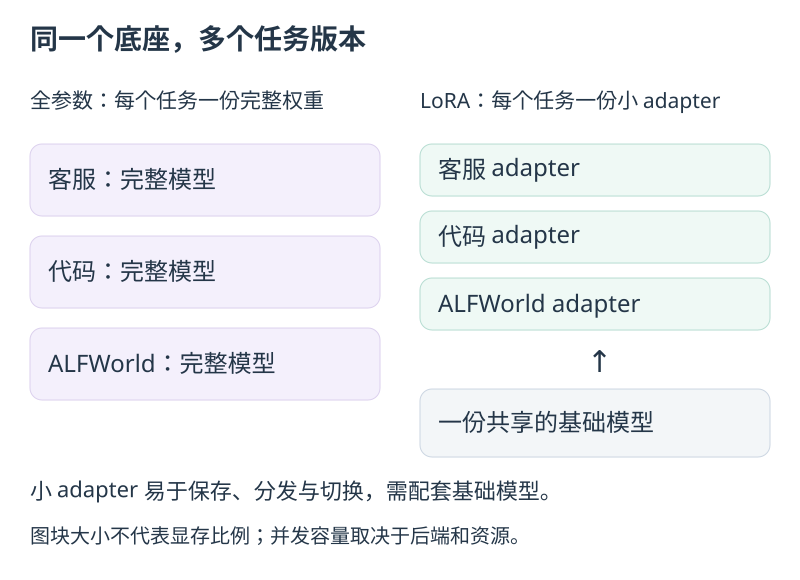
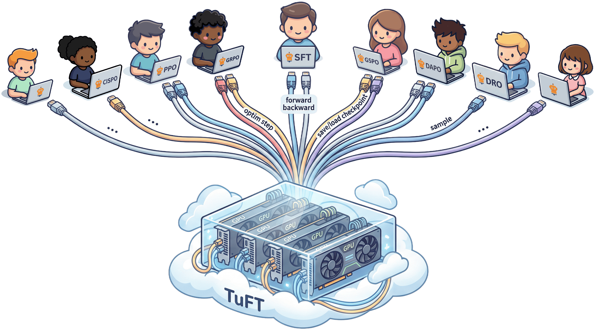
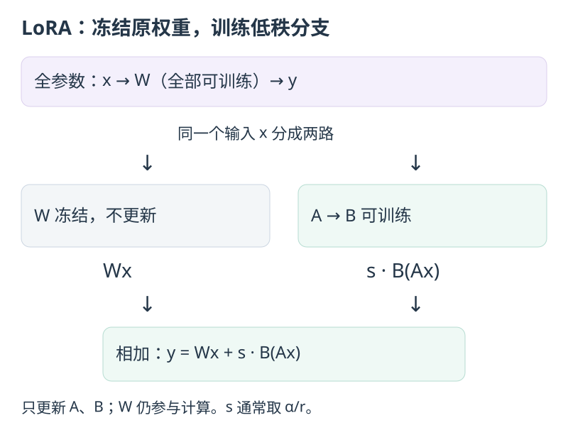
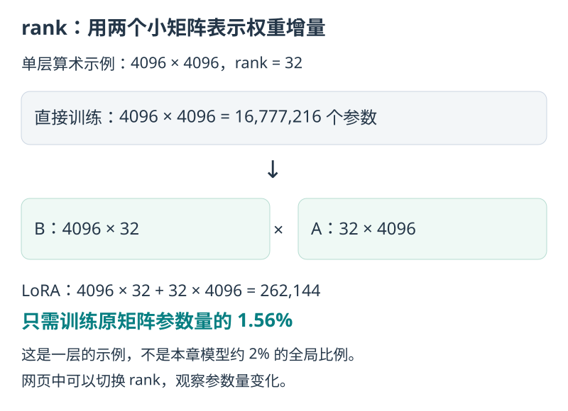
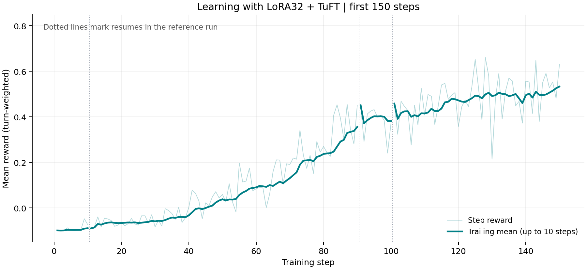

# 第 6 章：LoRA 实测与开放实验

> **一份基础模型，多个轻量任务版本。** 本章用图解释 LoRA 的用途和原理，再邀请你用 LoRA32 + TuFT 训练一个 ALFWorld adapter，对照参考曲线观察它学到了什么。

---

## 6.0 怎么用这一章

**推荐先动手做 §6.1 的 LoRA32 实践**：看图理解为什么用 LoRA、它如何工作，再启动训练，对照参考结果观察自己的学习曲线。

后续按需探索：**§6.2–6.6 是开放实验**，提供问题与配置思路，不提供参考结果；表中的 baseline 数据来自前五章。**§6.7 是已有数据的分析工具**，无需重训。

---

## 6.1 推荐实践：用 LoRA32 训练 ALFWorld

### 为什么用 LoRA：一个底座，多个任务版本

假设你要为客服、代码和 ALFWorld 各训练一个模型。全参数微调会得到三份完整权重；**LoRA 则保留同一份基础模型，每个任务只学习一份小型 adapter（适配器）**。新增任务时，需要保存、分发和加载的任务参数就少得多。



| 什么时候值得尝试？ | 你得到什么？ |
| --- | --- |
| 为同一个基础模型维护多个任务版本 | 每个任务单独保存、分发 adapter |
| 在同一组后端上训练或服务多个任务 | 共享基础权重，各任务保留自己的 adapter |
| 希望减轻微调时的训练状态负担 | 只为少量参数维护梯度和优化器状态 |

推理框架如 [vLLM 可以按请求选择不同 adapter](https://docs.vllm.ai/en/latest/features/lora/#serving-lora-adapters)；[TuFT](https://github.com/agentscope-ai/TuFT) 则让多个客户端共享训练与采样后端。**本节先训练一个 ALFWorld adapter，学会这套方法后，再扩展到自己的任务。** 共享要求基础模型兼容，实际并发容量取决于后端配置与显存。

<details>
<summary>看看 TuFT 如何共享训练与采样后端</summary>



同一基础模型上的任务共享冻结权重，各自维护 adapter、优化器状态和 checkpoint。不同基础模型可以由同一平台管理，但不能共用同一份基础权重。

</details>

### 原理图解：原权重不动，只学一条小分支

把模型里的一层线性变换想成 `y = Wx`：输入 `x` 经过权重 `W` 得到输出 `y`。全参数训练直接更新 `W`；LoRA 保留它，另加一条由两个小矩阵 `A`、`B` 组成的分支。



**训练目标没有换，换的是可以更新哪些参数。** 本例仍用多步 GRPO，优化器只更新 `A`、`B`；基础模型仍参与计算。Trinity 组织任务采样和 RL 流程，TuFT 提供训练与采样服务。

**rank 是这条小分支中间的宽度。** `A` 先把输入映射到 `r` 维，`B` 再映射回输出维度。用 `B × A` 表示权重增量时，只需学习两块较小矩阵中的参数。



本例对 **Qwen3-1.7B 使用 rank 32**，总计训练约 **3490 万个参数，约为基础模型的 2%**。这是可训练参数比例，不是显存或耗时比例。

<details>
<summary>参数量怎么算？rank 变大意味着什么？</summary>

原矩阵有 `输入维度 × 输出维度` 个参数，LoRA 分支有 `r × (输入维度 + 输出维度)` 个参数。上图中的单层例子是 `32 × (4096 + 4096) = 262144`，约为原矩阵的 1.56%；全模型的约 2% 则来自多个层、七类投影的合计。

增大 rank 会增加可训练参数和表达能力，但不保证任务效果一定变好。冻结基础权重也不等于截断梯度：训练仍需经过基础模型计算。原理出处见 [LoRA 论文](https://arxiv.org/abs/2106.09685)。

</details>

### 三步运行：复用第一章的模型和数据

**沿用第一章的 Linux x86_64、8×A100 80GB 服务器和模型、数据目录。** 开始前释放本例需要的 GPU；首次准备服务器时，按 [LoRA32 运行参考](./lora32_reproduction.md) 检查依赖。

**第一步：进入教程仓库。** 已完成第一章，直接使用当前目录。

<details>
<summary>还没有本章代码？展开获取命令</summary>

```bash
git clone --branch tutorial --single-branch https://github.com/agentscope-ai/Trinity-RFT.git agentic-rl
cd agentic-rl
```

</details>

**第二步：一条命令启动。** 自动复用第一章根目录 `.env` 的模型和数据路径；未设置时使用 `./models/Qwen3-1.7B` 和 `./alfworld_data`，缺失时自动下载，无需重新填写路径。

```bash
bash examples/alfworld_lora32/run.sh
```

脚本安装配套版本、准备数据并启动训练，默认 **72 个 runner、150 步，每 10 步保存一次**。只想先检查条件，可以在命令末尾加 `--check`。

**第三步：对照曲线看结果。** 启动时会打印日志目录，观察 `critic/score/mean` 的趋势。结束时日志应到达第 150 步，并有 `global_step_150/` 存档；保留整个示例工作目录，方便续训。

<details>
<summary>在另一个终端查看默认训练日志</summary>

```bash
LORA32_RUN_DIR="$HOME/.cache/agentic-rl/alfworld-lora32/checkpoints/ALFWORLD/Step_Wise_Alfworld_TuFT_lora32_lr5e5_speed_reader72_001"
tail -f "$LORA32_RUN_DIR/log/trainer.log"
```

更多配置、固定版本和中断续跑方式见 [LoRA32 运行参考](./lora32_reproduction.md)。

</details>

### 对照结果：少量参数能学会任务吗？

**可以观察到学习，但不必一直增加步数。** 参考曲线在 120–150 步进入较高区间，141–150 步平均训练分数为 **+0.5331**；训练到 250 步后，末尾 10 步均值回落到 +0.4046。因此，本节先用 150 步观察学习过程，再评测保存的模型。



参考曲线来自 LoRA32 加速版实验，期间调整过采样并发并从存档继续；本节练习从零固定使用 72 个 runner，供你对照学习趋势，不要求逐点一致。

| 看什么 | 参考结果 | 你运行时怎样对照 |
| --- | --- | --- |
| 学习过程 | 120–150 步进入较高区间 | 观察训练分数的趋势与波动，而非单步最高点 |
| 留出任务表现 | 第 250 步模型：**211/280 = 75.36%** | 用相同任务和评测设置比较保存的模型 |

**75.36% 是第 250 步模型的评测结果，不是 150 步练习的预期成功率。** 图中的训练分数按对话步加权，也不能直接换算成测试成功率。

<details>
<summary>查看参考实验的完整配置与评测口径</summary>

| 项目 | 参考实验 |
| --- | --- |
| 模型 / 环境 | Qwen3-1.7B / ALFWorld |
| 微调方式 | LoRA rank 32，基础模型冻结 |
| 目标模块 | `q_proj`、`k_proj`、`v_proj`、`o_proj`、`gate_proj`、`up_proj`、`down_proj` |
| 学习率 / KL 系数 | `5e-5` / `0.001` |
| 组内采样 / 轨迹上限 | 每题 16 条轨迹 / 每条最多 30 个环境步 |
| 参考实验 | 共训练 250 步；本节先看前 150 步 |
| 硬件 | 8×A100，4 卡采样、4 卡训练 |

这里的学习率是全参数基线的 10 倍，是本次实际采用的条件；不能由“LoRA 参数少”直接推出应该使用这个学习率。微调方式、后端、采样节奏等条件同时改变，因此本例不是只改变 LoRA 一项的严格对照。

评测使用 140 个留出任务，每题运行两次，温度 1.0，每次最多 30 个环境步、每次生成最多 512 tokens。250 步训练的分数全期均值为 **+0.2996**；它来自训练采样，与独立评测回答不同的问题。

</details>

<details>
<summary>与全参数曲线对照，以及训练时间预算（Estimated）</summary>

左侧是两次历史实验的实测训练曲线；右侧是历史加速版在 72 个 runner 下的耗时外推（150 步约 35 小时）。**当前上游配置的微批处理方式已变化，这个估算不能直接作为新版运行预算。** 请先短程运行，再按自己的日志估算总耗时；安装、下载和启动时间另计。


| 比较项 | 前五章全参数基线（verl） | LoRA32 参考实验（历史 TuFT 加速版） |
| --- | --- | --- |
| 可训练参数 | 约 17 亿 | **约 3490 万，约为前者的 2%** |
| 梯度和优化器状态 | 为全部可训练参数维护 | 只为 adapter 参数维护，所需状态更少 |
| 任务模型的保存与部署 | 每个任务保存对应的完整模型权重 | 可单独保存 adapter，多个任务共享基础模型 |
| 运行硬件 | 8×A100 80GB；4 卡采样、4 卡训练 | 相同卡数与分工 |
| 训练曲线 | 133 步；后期回落，事后选用 step-100 | 141–150 步达到最高 10 步均值，随后未持续改善 |
| 留出任务成功率 | 未提供同协议评测 | **step-250：211/280，75.36%** |

图中的分数定义相同，都是 **training batch 的平均 reward，按 turn / experience 加权**，不是每局等权成功率（见第 3 章 §3.3）。全参数在这条历史轨迹上更快提升；两次运行还改变了后端、学习率、采样并发和异步数据流，不能单凭这张图把差异全部归因于 LoRA。

| 目标训练步数 | 历史加速版外推时间（Estimated） |
| --- | ---: |
| 100 步 | 约 23.5 小时 |
| 130 步 | 约 30.6 小时 |
| 150 步（本章默认） | **约 35.3 小时** |

估算取参考实验第 103–150 步的完整 48 步记录：72 个 runner 已开始持续供给训练数据，平均每步约 **14.1 分钟**，再乘目标步数。这一窗口没有中途停训间隔，包含窗口内较慢的步骤和正常保存开销；起始恢复与填充阶段未用于估算。输入长度、生成轨迹和硬件负载会影响实际耗时，运行一段时间后应按自己的日志更新预算。

**为什么参数少了，耗时却不按比例减少？** LoRA 减少的是需要更新的参数，采样和训练处理的数据并没有同步减少：基础模型仍要处理全部 token，RL 还要与环境交互、计算参考模型概率并等待数据。增加 runner 主要缓解采样等待，不能同比缩短这些计算。因此，这里的时间用于安排本次练习，不是 LoRA 与全参数在同等效果下的成本排名。

本例没有峰值显存或费用的实测对照。可以明确量化的是可训练参数减少约 98%；更小的梯度、优化器状态和 adapter 带来资源优势，不能将这个比例直接写成整机显存或费用的降幅。

[图表数据与估算依据](https://github.com/agentscope-ai/Trinity-RFT/tree/tutorial/scripts/rl_tutorial/sample_data)随教程提供，便于重新绘图和比较自己的结果。

</details>

---

## 6.2 开放实验 A：早停与 checkpoint 选择

开展开放实验时，保留全参数 baseline 的配置和曲线，每次只改变一个因素及其必要的派生设置。先短跑检查，再决定是否完整训练。

### 探索问题与假设

> 第 5 章 §5.5 记录了 baseline 在 **step 115 达峰 0.936**，随后失稳并在 133 步手动停止。我们据此提出假设：监控训练信号、提前停止，可能避免末段退化。前文事后选用 `global_step_100`，但这不等于已经验证了一套能提前预测峰值的早停规则。

### 改什么

**可以比较以下三种做法**。前文 baseline 使用了第 3 种方式；你可以设计实验，比较另外两种方式的效果与成本：

```yaml
# 做法 1：为新实验设置明确的训练步数上限
trainer:
  total_steps: 100        # 示例上限；不是已经验证的最佳停止点

# 做法 2（推荐用于新实验）：跑全长，但监控 entropy/resp_len/ppo_kl 手动/自动刹车
#   不改 yaml，跑的时候盯 trainer.log：
#   grep -oE "'actor/entropy_loss': [0-9.]+" <ckpt>/log/trainer.log | tail
#   若这些信号持续异常，停止训练客户端，保留存档与服务后再评测
#   告警阈值需要根据自己的曲线确定，不能照搬一个通用数值

# 做法 3（本实验实际采用）：跑完/跑崩了也没关系，事后挑峰值 checkpoint
trainer:
  save_interval: 10       # 50 → 10，多存几个 checkpoint 以便挑峰值
#   然后直接取崩溃前最佳平台期的 checkpoint：global_step_100
```

### 观察与记录

| 策略 | 应记录什么 | 结果记录 |
|---|---|---|
| baseline（133 步）| 末段退化与各存档的表现 | 已有观察，见第 5 章 |
| 按预设信号早停 | 触发时间、节省的训练时间、留出任务成功率 | 记录实测值 |
| 更密集保存并选择存档 | 同一评测条件下各存档的表现、额外存储成本 | 记录实测值 |

### 延伸思考

这条曲线提醒我们：**更多训练不保证更好的模型**。RL 的采样数据会随策略变化，退化可能来得很快；监控训练信号、保存中间版本，再用固定任务评测，有助于及时发现问题。entropy 或 KL 的异常是排查线索，单靠这次曲线还不能证明退化由哪个因素造成。

---

## 6.3 开放实验 B：减小 G（repeat_times 16 → 8）

### 探索问题与假设

> 沿用第 3 章 §3.4 的简化估算：假设每条轨迹独立、成功概率均为 10%，G=16 时全失败概率约 18.5%，G=8 时约 43%。真实采样未必独立，因此这些是帮助理解组内信号的估算。减小 G 是否降低学习效率、能否节省时间，需要实测。

### 改什么

```yaml
algorithm:
  repeat_times: 8          # 16 → 8
buffer:
  train_batch_size: 3840   # 本建议按 G 的比例减半；也可以另做保持批大小不变的对照
```

`16 × G × 30` 是 16 题、每题 G 条轨迹都走满 30 步时的经验数上限，不是必须满足的等式。轨迹可能提前结束，队列也可以累计多批采样。本例同时减小训练批大小；若想单独研究 G 的影响，可以保持训练批大小不变，但要记录实际采样量和等待时间。

### 观察与记录

| 指标 | G=8 | G=16（baseline）|
|---|---|---|
| 每 step wall time | 记录实际耗时；数据量减少不保证耗时同比例下降 | 全期平均约 6.8 min |
| 全失败组概率（上述独立性假设下） | 约 43% | 约 18.5% |
| 到达 reward 0.8 所需 step | 记录步数，或注明未达到 | ~step 80 |
| 峰值 reward | 记录峰值与波动 | 0.936 |
| 12 小时的训练预算 | 记录实测值 | 按历史平均耗时估算约 106 步 |

### 延伸思考

G 是**稀疏 reward 任务最重要的旋钮**：太小 → 组内无差异、advantage 退化为 0；太大 → wall time 不划算。在成功概率 10% 且独立采样的估算下，G=16 让约 81.5% 的组至少出现一次成功；实际组内差异还取决于任务难度与采样相关性。**反过来想 G=32**：全失败组降到 0.9³²=3.4%，信号更足但每 step 数据量翻倍——适合攻最难的 `look_at_obj_in_light`（base 仅 2.6%，G=16 时大量全失败组）。

---

## 6.4 开放实验 C：换算法 multi_step_grpo → GiGPO

### 探索问题与假设

> 第 4 章 §4.3 进阶注脚：GiGPO 给每一步更细的「功劳分配」，理论上能修正「成功轨迹里废动作也被推高」的噪声。但 ALFWorld 状态空间大、哈希精确匹配，**锚点命中率可能不高** → A_S 大量退化为 0 → 效果接近纯 GRPO。这是个**开放的实证问题**。

### 改什么

**同一个 workflow，只改 algorithm 段**（直接用现成的 `examples/gigpo_alfworld/gigpo.yaml`，或复制 baseline 改）：

```yaml
algorithm:
  algorithm_type: gigpo        # multi_step_grpo → gigpo
  advantage_fn: gigpo
  advantage_fn_args:
    omega: 1.0                 # step-level 权重；试 omega=0 退化成纯 episode-level
    gamma: 1.0
    fnorm: none
```

> 注意 `gigpo.yaml` 的个别默认值与 baseline 不同（如 `max_response_tokens`、监控后端）。对比前先把它们对齐 baseline，否则不是单变量对比。

### 观察与记录

| 指标 | multi_step_grpo（baseline）| gigpo |
|---|---|---|
| 峰值 reward | 0.936 | 记录实测值 |
| `gigpo/anchor_group_hit_ratio` | — | 记录锚点匹配频率；结合 advantage 和学习曲线判断是否有用，没有通用阈值 |
| `gigpo/mean_abs_A_S` vs `A_E` | — | A_S ≪ A_E → step credit 贡献小 |
| 收敛速度 | ~step 80 到 0.8 | 记录实测值 |

### 延伸思考

这个 ablation 的价值不在「谁赢」，而在**理解 step-level credit assignment 在稀疏 reward 大状态空间下的局限**。如果 `anchor_group_hit_ratio` 很低，说明「精确状态哈希匹配」在 ALFWorld 太严格——改进方向是用更粗的状态表示（比如「当前房间 + 手持物」而非完整 observation 哈希）来提高锚点命中。这是真实的 research 问题。

---

## 6.5 开放实验 D：改 max_env_steps（30 → 20 / 50）

### 探索问题与假设

> 第 2 章观察到成功轨迹通常较短，部分失败轨迹会耗尽 30 步。把上限降到 20，可能减少长尾采样，也可能截断原本能成功的轨迹。升到 50 则提供更多尝试机会。对训练效果、吞吐和显存的实际影响，需要分别测量。

### 改什么

```yaml
buffer:
  explorer_input:
    taskset:
      workflow_args:
        max_env_steps: 20      # 30 → 20
  train_batch_size: 5120       # 本建议按轨迹上限的比例缩小；不是必须满足的等式
```

### 观察与记录

| 指标 | max_steps=20 | 30（baseline）| 50 |
|---|---|---|---|
| 每 step experience 数 | 记录实际采样与训练批大小 | 保留 baseline 日志作参考 | 记录实际采样与训练批大小 |
| 每 step wall time | 记录实际耗时 | 全期平均约 6.8 min | 记录实际耗时 |
| 序列长度与截断次数 | 记录实测值 | 保留 baseline 日志作参考 | 记录实测值 |
| 难任务（look_at_obj）表现 | 用相同任务评测 | 保留 baseline 作为对照 | 用相同任务评测 |
| 峰值显存 | 记录实测值 | 记录实测值 | 记录实测值 |

### 延伸思考

`max_env_steps` 决定 agent 最多有多少次尝试机会。**降到 20 是一个潜在的提速方向**，但不能提前认定被截掉的轨迹都会失败，也不能把上限减少三分之一直接换算成耗时节省。应同时记录被截断的比例、任务表现和完成训练批次的时间。

---

## 6.6 开放实验 E：lr 与 kl_coef（检验退化原因）

### 探索问题与假设

第 5 章观察到末段训练分数回落。一个待检验的解释是：当前学习率与 KL 约束的组合，允许策略在后期偏离过多。分别增加 kl_coef 或降低 lr，可以检验它们是否改善稳定性；现有曲线还不足以确定因果关系。

### 改什么（两个独立实验，别同时改）

```yaml
# E-1：加大 KL 约束
algorithm:
  kl_loss_fn_args:
    kl_coef: 0.01          # 0.001 → 0.01（10×）

# E-2：降 lr
algorithm:
  optimizer:
    lr: 1e-6               # 5e-6 → 1e-6
```

### 观察与记录

| 指标 | baseline | kl_coef=0.01 | lr=1e-6 |
|---|---|---|---|
| 峰值 reward | 0.936 @115 | 记录实测值 | 记录实测值 |
| 后期是否退化 | step 116 后回落 | 检查回落时间与幅度 | 检查回落时间与幅度 |
| step 121 reward | 0.439 | 记录实测值 | 记录实测值 |
| entropy @120 | 0.67 | 观察是否随约束增强而降低 | 观察变化幅度 |
| 达到指定分数的耗时 | 用历史曲线作参考 | 记录实际耗时 | 记录实际耗时 |

### 延伸思考

lr 控制每次参数更新的步长，kl_coef 控制偏离参考策略的代价；两者会共同影响学习速度和策略变化。先分别改变一个参数，并使用相同评测设置，才能判断稳定性是否改善、是否牺牲了学习效果。

---

## 6.7 分析工具：任务族成功率分解（不用重训）

> 这不是 ablation，是**对已有 baseline 产物的分析**——回答第 0 章 §0.2 的「难度阶梯」问题：训练后哪些任务族学会了、哪些没学会。

```bash
# 从预置真实样本看早/后期 6 个任务族的成功率
python scripts/rl_tutorial/ch6_task_family_breakdown.py --sample

# 或指向你自己的完整 buffer
python scripts/rl_tutorial/ch6_task_family_breakdown.py \
  --buffer checkpoints/ALFWORLD/Step_Wise_Alfworld/buffer/alfworld_buffer.jsonl \
  --taskset examples/grpo_alfworld/alfworld_data/train.jsonl
```

**本实验真实结果**（运行上面命令可复现）：

| 任务族 | 早期成功率 | 后期成功率 | 提升 | 解读 |
|---|---:|---:|---:|---|
| `pick_and_place` | 27.8% | **97.2%** | +69 pp | 单目标，最先学会、几乎满分 |
| `pick_heat_then_place` | 4.7% | 93.5% | +89 pp | 多子目标，提升最大 |
| `pick_clean_then_place` | 3.6% | 92.3% | +89 pp | 多子目标 |
| `pick_two_obj` | 5.8% | 90.6% | +85 pp | 要找两个物体 |
| `pick_cool_then_place` | 1.5% | 86.3% | +85 pp | base 几乎不会，提升巨大 |
| `look_at_obj_in_light` | 2.6% | **69.4%** | +67 pp | **最难**：要到灯下看，仍 30% 失败 |
| **整体** | **10.0%** | **90.3%** | **+80 pp** | |

**怎么读这张表**：

1. **难度阶梯被 RL「填平」了大部分**：base 时最简单的族（27.8%）和最难的族（1.5%）差 18 倍；训练后差距缩小到 97% vs 69%。RL 把「几乎不会」的任务拉到「大部分会」。
2. **`look_at_obj_in_light` 是天花板**：即使训练后仍 30% 失败。它需要「找到物体 → 找到台灯/desk lamp → 拿过去看」，比「放到 receptacle」多一层抽象（目标不是「放」而是「在灯下看」）。**这是下一轮实验该重点攻的族**（比如对它单独加大 G，见实验 B 延伸）。
3. **多子目标任务提升最大**（heat/cool/clean +85~89pp）：说明 RL 主要教会了模型「子目标规划」——第 2 章 §2.3 那条「找 cup→冷却→放置」的成功轨迹就是典型。

### 延伸思考

**任务族分解是 agentic-RL 最有价值的分析**——整体 reward 0.9 会掩盖「某个族还在 69% 挣扎」。生产里你永远要按任务子类型拆解成功率，找到「拖后腿的族」针对性优化（加数据、加 G、改 reward）。这比盯着一条总曲线有用得多。

---

## 6.8 本章回顾与实践目标

完成 LoRA32 推荐实践后，可以结合参考结果分析自己的训练，并区分训练分数与测试成功率。开展开放实验时，可以用以下目标检查自己的理解：

- ✅ 能启动 LoRA32 示例，并区分可训练参数量、显存、耗时与费用；
- ✅ 能区分训练分数与留出任务成功率，知道如何评测不同 checkpoint；
- ✅ 能提出一次可检验的配置改动，记录采样量、训练时间和学习效果；
- ✅ 能观察训练退化的信号，同时区分现象、原因假设与验证结果；
- ✅ 能按任务族分析结果，寻找下一次实验要解决的问题。

---

## 6.9 教程到此结束 — 接下来去哪

1. **更大模型**：把 `model_path` 换成 Qwen3-4B/7B，看天花板能推到多高（显存不够时框架有 offload 等手段，见第 5 章 §5.4 悬停提示）；
2. **更难环境**：ALFWorld 之外，试 [`examples/grpo_webshop`](https://github.com/agentscope-ai/Trinity-RFT/tree/main/examples/grpo_webshop)（网购）、[`examples/grpo_sciworld`](https://github.com/agentscope-ai/Trinity-RFT/tree/main/examples/grpo_sciworld)（科学实验，在 Trinity 主仓库）——同样的 step-wise workflow 模式；
3. **GiGPO 深入**：把实验 C 的 `anchor_group_hit_ratio` 做出来，如果太低，试「粗粒度状态哈希」改进（§6.4 延伸）；
4. **评估全参数 baseline 的 checkpoint**：把前文推荐的 **`global_step_100`**（崩溃前最佳平台）checkpoint 转成 HF 格式，在 `test.jsonl`（140 个 valid_seen 任务）上做离线评测，对比训练曲线；

最后，欢迎在 [Trinity-RFT issue 页面](https://github.com/agentscope-ai/Trinity-RFT/issues)反馈（请注明 RL Tutorial），或向 `tutorial` 分支提交 PR——让具身 Agentic RL 从「少数有集群的团队能做的事」变成「每个有 GPU 的工程师都能上手的事」。

---

**上一章**：[第 5 章：权重怎么更新](./ch5_loss与权重更新.md) ｜ **返回**：[教程总览](./README.md)
