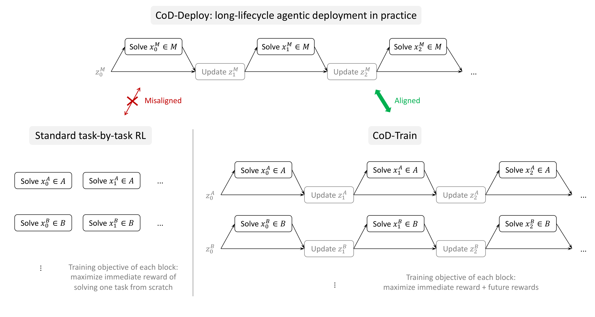
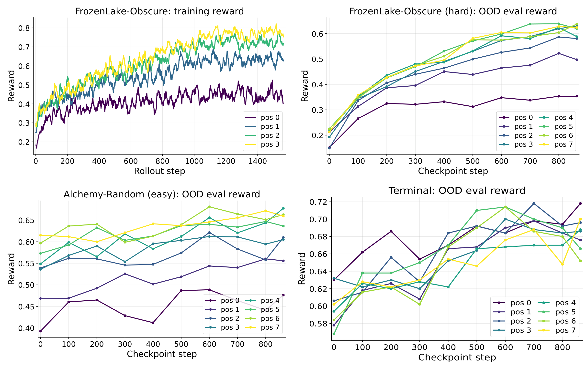
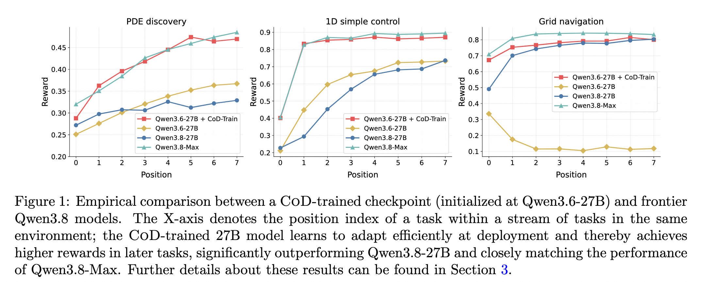

**English** | [**中文**](README_zh.md)

# Connect the Dots (CoD)

**Training LLMs for Long-Lifecycle Agents with Cross-Domain Generalization Via Reinforcement Learning**

As an LLM-based AI agent gets deployed in an environment, it solves a long sequence of tasks while continuously exploring the environment, learning from its own experiences, and iteratively self-updating its context about the environment, thereby achieving progressively better performance on future tasks conditioned on the updated context.

CoD groups related tasks into a pack and generates a long rollout trajectory interleaving **solve-task** and **update-context** episodes: after each task, the model updates its context (a short `Hints:` block), and later tasks are solved conditioned on the updated context.
The whole pack is trained end-to-end with RL, with fine-grained credit assignment rewarding context updates that make future tasks easier.
A trained model's reward rises across pack positions, which is the signature of the elicited CoD meta-capability.

<p align="center">
  
  <br><sub><em>Figure 1: a visualization of CoD-Deploy and CoD-Train (compared with standard task-by-task RL). Environments A and B are used for training; M is a new environment for deployment or evaluation. Each block is one rollout episode, for solving a task x_i (which may itself be a long-horizon multi-turn task) or for updating the agent's context z_i about the current environment.</em></sub>
</p>

---

## How it works

```
pack = [ task0, task1, task2, task3 ]      # related tasks from one taskset (size = task_pack_size; 4 shown here)

 task0  --solve(no hint)-->      reward0, feedback0  --gen hint-->  hint1
 task1  --solve(hint1)-->        reward1, feedback1  --gen hint-->  hint2
 task2  --solve(hint2)-->        reward2, feedback2  --gen hint-->  hint3
 task3  --solve(hint3)-->        reward3
```

- **Pack**: related tasks from one taskset grouped together; size set by `task_pack_size` (train) / `eval_task_pack_size` (eval), grouped in `pack_tasks()`.
- **Position**: a task's index in the pack; position k is solved with the hint distilled from the prior k tasks, so a later position means the model has learned more in context.
- **Task reward**: each task_i's reward from the environment (correct / wrong, or graded), minus length penalties on over-long solutions and hints (to encourage brevity).
- **Iterative hint**: after each solve the model updates its context (the `Hints:` block) from `(prev hint, trajectory, reward, feedback)`, and the next solve prepends it to the prompt.
- **Fine-grained credit assignment (reward-to-go)**: following the classical dynamic-programming principle, each episode (solve-task or update-context) is credited with the rewards of the current and future tasks. A context update that helps later tasks scores higher, so the model learns to write useful hints.

Key metric: `reward_iterative_hint_e2e_taskset_{ts}_pos_{pos}`, the mean reward per pack position; reward rising with position is the CoD effect.

<p align="center">
  
  <br><sub><em>Figure 2: the CoD effect with Qwen3-8B. Reward rises across pack positions during training and at OOD evaluation, both in-domain (harder FrozenLake) and cross-domain (Alchemy, Terminal).</em></sub>
</p>

<p align="center">
  
  <br><sub><em>CoD-trained Qwen3.6-27B compared with the base model, Qwen3.8-27B, and Qwen3.8-Max on PDE Discovery, Optimal Control, and Grid Navigation.</em></sub>
</p>

---

## Environments

In each environment, the tasks in a pack share something reusable: sometimes a hidden rule (action mapping, crafting recipe), sometimes a solving strategy or a pitfall. The model figures it out from interaction and feedback, writes it into a hint, and carries it to the later tasks in the pack.

| Environment | `default_workflow_type` | Transferable knowledge within a pack |
|---|---|---|
| FrozenLake-Obscure | `cod_frozenlake_obscure_workflow` | A hidden action mapping: which move each of codes 1–4 stands for |
| Alchemy-Random | `cod_random_alchemy_workflow` | A hidden crafting recipe: which elements combine into which new element |
| Terminal | `cod_terminal_workflow` | How commands and paths work and their pitfalls, and roughly where files live |
| Learn2Ask | `cod_learn2ask_workflow` | When to keep asking vs. when to stop and give a diagnosis |
| Optimal Control | `cod_optimalcontrol_workflow` | Learn the system's hidden dynamics from feedback and use them to reach new target states |
| PDE Discovery | `trinity.common.workflows.connect_the_dots.pde_discovery.workflow.CoDPDEDiscoveryWorkflow` | Discover the unknown reaction term from sampled data and refine it across tasks |
| Grid Navigation | `cod_grid_navigation_workflow` | Explore a shared cost map and use accumulated observations to choose lower-cost routes |

Implementations live in [`trinity/common/workflows/connect_the_dots/`](../../trinity/common/workflows/connect_the_dots/).

---

## Layout

```
examples/research_cod/
├── get_*_data.py        # environment data generators
├── exp_plan_final/      # main study
│   ├── train/           # training configs
│   └── bench/           # eval configs
└── exp_plan_learn2ask/   # data prep for learn2ask

trinity/common/workflows/connect_the_dots/   # CoD workflow implementation
├── cod_workflow.py     # packing / iterative hint / task reward
├── base_workflow.py    # AsyncCoDMultiStepWorkflow base class
└── <env>/              # each environment has its own subdir
    ├── workflow.py     # task rendering / scoring
    └── prompts/        # system / user prompts

trinity/algorithm/advantage_fn/cod_advantage.py   # reward-to-go credit assignment (CoDAdvantageFn)
```

---

## Quickstart

```bash
git clone <REPO_URL>
cd <REPO_DIR>
conda create -n trinity python=3.12 && conda activate trinity
pip install -e ".[vllm,flash_attn]"
pip install gymnasium jinja2 pandas
```

**1. Generate data.**
```bash
# FrozenLake-Obscure
python examples/research_cod/get_frozen_lake_data.py --local_dir examples/research_cod/data/frozen_lake_4567 \
    --train_size 50000 --test_size 4000 --map_min_size 4 --map_max_size 5 --tile_min_prob 0.6 --tile_max_prob 0.7
python examples/research_cod/get_frozen_lake_data.py --local_dir examples/research_cod/data/frozen_lake_6767 \
    --train_size 50000 --test_size 4000 --map_min_size 6 --map_max_size 7 --tile_min_prob 0.6 --tile_max_prob 0.7
# Alchemy-Random
python examples/research_cod/get_alchemy_data.py  --local_dir examples/research_cod/data/alchemy_random --train_size 50000 --test_size 4000 --seed 42
# Terminal
python examples/research_cod/get_terminal_data.py --local_dir examples/research_cod/data/terminal --train_size 50000 --test_size 4000 --seed 42 --composite_ratio 0.5
# PDE Discovery
python examples/research_cod/get_pde_discovery_data.py \
    --local_dir examples/research_cod/data/pde_discovery_runtime_seed \
    --train_size 50000 --test_size 32 --seed 42
# Optimal Control
python examples/research_cod/get_optimal_control_data.py \
    --local_dir examples/research_cod/data/optimal_control \
    --train_size 50000 --test_size 4000 --difficulty hard --train_seed 42 --test_seed 2024
# Grid Navigation
python examples/research_cod/get_grid_navigation_data.py \
    --local_dir examples/research_cod/data/grid_navigation \
    --train_size 50000 --test_size 4000 --seed 42
```

**2. Train CoD models.**
Set `TRINITY_MODEL_PATH` to the local model directory and adjust `cluster` (node count / GPUs per node) in the YAML for your hardware. In the W&B project selected by the config, watch `rollout/reward_iterative_hint_e2e_taskset_0_pos_{pos}/mean` to compare rewards across pack positions.
```bash
# FrozenLake-Obscure
trinity run --config examples/research_cod/exp_plan_final/train/frozen_lake_obscure.yaml
# Mixed (joint training on FrozenLake-Obscure + Alchemy-Random)
trinity run --config examples/research_cod/exp_plan_final/train/mixed_flobs_alchran.yaml

# Qwen3.6-27B
pip install -e ".[qwen3_5]"
export TRINITY_MODEL_PATH=/path/to/Qwen3.6-27B

# PDE Discovery
trinity run --config examples/research_cod/exp_plan_final/train/pde_discovery_cod_600steps_hard.yaml
# Optimal Control
trinity run --config examples/research_cod/exp_plan_final/train/optimal_control_improve.yaml
# Grid Navigation
trinity run --config examples/research_cod/exp_plan_final/train/grid_navigation_27b.yaml
```

Mixed OPD uses one teacher per domain, with tokenizers compatible with the student:

```bash
# Convert teacher checkpoints to Hugging Face format
PDE_CKPT=/path/to/pde-run/global_step_75
CONTROL_CKPT=/path/to/control-run/global_step_200
GRID_CKPT=/path/to/grid-run/global_step_100
for ckpt in "$PDE_CKPT" "$CONTROL_CKPT" "$GRID_CKPT"; do
    trinity convert --checkpoint-dir "$ckpt" --base-model-dir "$TRINITY_MODEL_PATH"
done

# Mixed OPD: PDE + Optimal Control + Grid Navigation
export TRINITY_PDE_TEACHER_MODEL_PATH="$PDE_CKPT/actor/huggingface"
export TRINITY_OPTIMAL_CONTROL_TEACHER_MODEL_PATH="$CONTROL_CKPT/actor/huggingface"
export TRINITY_GRID_NAVIGATION_TEACHER_MODEL_PATH="$GRID_CKPT/actor/huggingface"
trinity run --config examples/research_cod/exp_plan_final/train/pde_control_grid_opd.yaml
```

**3. Evaluate.**
Evaluate each saved checkpoint, measuring out-of-distribution generalization both in-domain (harder versions of the training environments) and cross-domain (environments unseen in training).
```bash
# FrozenLake-Obscure ckpt → FrozenLake-hard (in-domain) + Alchemy-easy / Terminal (cross-domain)
bash examples/research_cod/exp_plan_final/bench/run_eval.sh --train-tasks frozen_lake_obscure
# Mixed ckpt → FrozenLake-hard + Alchemy-hard / Terminal
bash examples/research_cod/exp_plan_final/bench/run_eval.sh --train-tasks mixed_flobs_alchran
```

PDE Discovery, Optimal Control, and Grid Navigation share a checkpoint benchmark. Generate the PDE evaluation set; reuse the Control and Grid test sets above:

```bash
python examples/research_cod/get_pde_discovery_data.py \
    --local_dir examples/research_cod/data/pde_discovery_eval_hard_stratified_4000_disjoint_testonly \
    --train_size 1 --test_size 4000 --seed 20260902 \
    --eval_pack_size 8 --eval_template_count 25 \
    --eval_ground_truth_family physical_full_eval_4000.json --test_only
```

Set `EVAL_PROJECT`, `EVAL_GROUP`, and `EVAL_NAME` to the checkpoint run. `TRINITY_MODEL_PATH` points to the base model; each `global_step_*/actor/` must contain `model.safetensors`.

```bash
export TRINITY_CHECKPOINT_ROOT_DIR=/path/to/checkpoints

# PDE RL checkpoints → all three environments
EVAL_PROJECT=trinity-cod EVAL_GROUP=pde_discovery EVAL_NAME="your-pde-run" EVAL_TRAIN_DOMAIN=pde \
    trinity run --config examples/research_cod/exp_plan_final/bench/eval_source_checkpoints_all_domains.yaml
# Optimal Control RL checkpoints → all three environments
EVAL_PROJECT=trinity-cod EVAL_GROUP=optimal_control EVAL_NAME="your-control-run" EVAL_TRAIN_DOMAIN=control \
    trinity run --config examples/research_cod/exp_plan_final/bench/eval_source_checkpoints_all_domains.yaml
# Grid Navigation RL checkpoints → all three environments
EVAL_PROJECT=trinity-cod-final EVAL_GROUP=grid_navigation EVAL_NAME="your-grid-run" EVAL_TRAIN_DOMAIN=grid \
    trinity run --config examples/research_cod/exp_plan_final/bench/eval_source_checkpoints_all_domains.yaml
```

Mixed OPD checkpoint evaluation (select a directory containing steps 5, 10, …, 60; step 0 evaluates the base model):

```bash
EVAL_PROJECT=trinity-cod EVAL_GROUP=mixed_multi_teacher_opd EVAL_NAME="your-mixed-opd-eval-run" \
    trinity run --config examples/research_cod/exp_plan_final/bench/eval_mixed_opd_steps_0to60_all_domains.yaml
```

---

## Key config knobs (`cod.cod_workflow_args`)

| Field | Meaning |
|---|---|
| `activated_cod_methods` | CoD methods to enable; the main study uses `["iterative_hint_e2e"]` |
| `hint_penalty_coef` / `length_penalty_coef` | Length penalty on hints / on a correct solution |
| `task_pack_size` / `eval_task_pack_size` | Pack size for training / evaluation |

---

## Adding a CoD environment

1. Subclass the CoD base workflow in `trinity/common/workflows/connect_the_dots/<env>/workflow.py` (see `frozen_lake/workflow_obscure.py` for a compact example).
2. Register `"cod_<env>_workflow": "...workflow.CoD<Env>Workflow"` in the `default_mapping` dict of [`trinity/common/workflows/__init__.py`](../../trinity/common/workflows/__init__.py).
3. Add a generator + config under `examples/research_cod/`, setting `default_workflow_type: 'cod_<env>_workflow'`.

After subclassing `AsyncCoDMultiStepWorkflow` (`base_workflow.py`), implement:

- `step_async(step_num)`: build the prompt for the task, call the model, apply its action / grade its answer, write the reward into `self.final_reward`, and return `(continue, experiences)`.
- `_get_feedback()`: return the environment's feedback for this step (written into `exp.info["feedback"]`, used to generate the hint).
- `max_step_num`: the max number of steps per task.

---

## Citation

```bibtex
@article{chen2026connect,
  title={Connect the Dots: Training LLMs for Long-Lifecycle Agents with Cross-Domain Generalization Via Reinforcement Learning},
  author={Chen, Yanxi and Shi, Weijie and Xie, Yuexiang and Hu, Boyi and Li, Yaliang and Ding, Bolin and Zhou, Jingren},
  journal={arXiv preprint},
  year={2026}
}

@article{pan2025trinity,
  title={Trinity-rft: A general-purpose and unified framework for reinforcement fine-tuning of large language models},
  author={Pan, Xuchen and Chen, Yanxi and Chen, Yushuo and Sun, Yuchang and Chen, Daoyuan and Zhang, Wenhao and Xie, Yuexiang and Huang, Yilun and Zhang, Yilei and Gao, Dawei and others},
  journal={arXiv preprint arXiv:2505.17826},
  year={2025}
}
```
